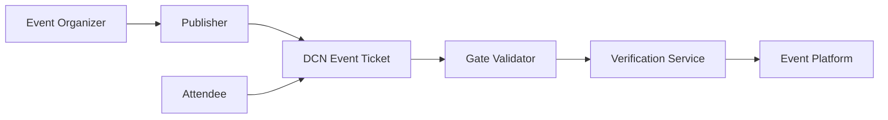

# Event Tickets

> _The DCN Standard enables event tickets to become secure Physical Digital Assets, providing cryptographic authenticity, programmable access control, counterfeit protection, and seamless attendee experiences for concerts, sports, conferences, transportation, and entertainment events._

***

## Introduction

The global event industry issues billions of tickets every year.

These include:

* Concerts
* Sports events
* Conferences
* Festivals
* Movies
* Museums
* Theme parks
* Exhibitions
* Transportation
* VIP experiences

Despite advances in digital ticketing, many challenges remain:

* Ticket fraud
* Counterfeit tickets
* Unauthorized duplication
* Ticket scalping
* QR code sharing
* Manual identity verification
* Poor interoperability

The DCN Standard transforms tickets into **trusted Physical Digital Assets**, where authenticity is verified cryptographically rather than visually.

A ticket becomes more than proof of purchase.

It becomes a secure digital credential.

***

## Vision

The objective is to provide a ticketing system that is:

* Secure
* Easy to verify
* Difficult to counterfeit
* Fast to validate
* Easy to transfer (where permitted)
* Programmable
* Interoperable
* Blockchain-connected

The attendee experience should be as simple as **tap and enter**.

***

## Event Ticket Architecture



The Publisher issues the ticket, while verification services confirm authenticity and access rights at the venue.

***

## Ticket Lifecycle

Every event ticket follows a controlled lifecycle.


Additional lifecycle states may include:

* Suspended
* Cancelled
* Refunded
* Reissued

Lifecycle management prevents duplicate entry and unauthorized reuse.

***

## Ticket Types

The DCN Standard supports multiple ticket categories.

#### General Admission

Standard event access.

***

#### Reserved Seating

Assigned seats with section, row, and seat information.

***

#### VIP Passes

Premium access with additional privileges.

***

#### Multi-Day Passes

Valid across multiple event dates.

***

#### Season Passes

Support recurring attendance over an extended period.

***

#### Staff & Media Credentials

Secure credentials for employees, contractors, media, and event personnel.

***

## Ticket Metadata

A ticket may securely store or reference metadata such as:

* Event Identifier
* Venue
* Event Date
* Entry Window
* Seat Information
* Ticket Category
* Publisher
* Validity Status

Sensitive information may remain protected according to Publisher policies.

***

## Attendee Experience

The ticket validation process is intentionally simple.

1. The attendee arrives at the venue.
2. The ticket is tapped on a validation device.
3. Authenticity is verified.
4. Ticket status is checked.
5. Entry authorization is confirmed.
6. Access is granted.

The complete interaction typically occurs within seconds.

***

## Transfer Policies

Event organizers may define transfer policies.

Examples include:

* Freely transferable
* One-time transfer
* Identity-bound
* Time-limited transfer
* Marketplace-only transfer
* Non-transferable

These policies can be enforced using the **DCN-P (Programmable)** asset profile.

***

## Anti-Counterfeit Protection

The DCN Security Architecture protects against:

* Ticket duplication
* QR code sharing
* NFC cloning
* Unauthorized reproduction
* Forged credentials
* Replay attacks

Verification relies on cryptographic authentication rather than printed graphics or barcodes.

***

## Venue Benefits

Venue operators benefit from:

* Faster attendee processing
* Reduced fraud
* Automated validation
* Real-time entry monitoring
* Standardized APIs
* Improved operational analytics
* Reduced manual inspection

This improves both security and visitor experience.

***

## Organizer Benefits

Event organizers gain access to:

* Secure ticket issuance
* Lifecycle management
* Real-time validation statistics
* Transfer policy enforcement
* Revocation capabilities
* Attendance analytics
* Multi-channel distribution

The Publisher Platform provides centralized management while maintaining interoperability.

***

## Business Opportunities

The DCN Event Ticket model supports:

* Concert organizers
* Sports leagues
* Conference platforms
* Transportation operators
* Theme parks
* Museums
* Cinema chains
* Airlines
* Cruise operators
* Exhibition organizers

Each organization can create branded ticket products using the same technical infrastructure.

***

## Example Event Products

```
DCN Ticket Portfolio

├── Concert Ticket
├── Stadium Pass
├── Conference Badge
├── Museum Entry
├── Theme Park Pass
├── Cinema Ticket
├── Transit Pass
├── VIP Credential
└── Backstage Access
```

The same Publisher Platform can issue and manage multiple event products.

***

## Future Evolution

Future ticketing capabilities may include:

* Dynamic seating upgrades
* AI-powered crowd management
* Cross-event digital passes
* Loyalty integration
* Collectible post-event memorabilia
* NFT-backed commemorative tickets
* Smart venue access
* Multi-event subscription passes

These capabilities extend the value of the ticket beyond simple event admission.

***

## Design Principles

Event Tickets using the DCN Standard follow five principles.

#### Authentic

Cryptographic verification replaces visual inspection.

#### Secure

Protected against counterfeiting and unauthorized duplication.

#### Programmable

Supports flexible transfer and access policies.

#### Fast

Optimized for high-throughput venue entry.

#### Interoperable

Compatible with compliant wallets, verification services, and venue systems.

***

## Summary

The DCN Standard transforms event tickets into secure, programmable Physical Digital Assets.

By combining trusted hardware, standardized verification, lifecycle management, and programmable access policies, event organizers can reduce fraud, improve operational efficiency, and deliver a faster, more secure, and more engaging attendee experience across entertainment, transportation, and public events.
