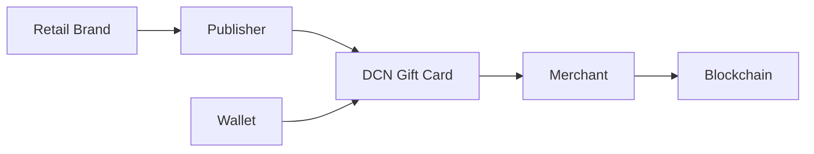

# Gift Cards

> _The DCN Standard transforms traditional gift cards into programmable Physical Digital Assets. By combining secure hardware, digital ownership, and blockchain-backed verification, Gift Cards become reusable, transferable, and interoperable digital products that can operate across physical stores, e-commerce platforms, and global merchant networks._

***

## Introduction

Gift cards represent one of the world's largest prepaid payment markets.

Today, billions of dollars are stored in:

* Retail Gift Cards
* Shopping Vouchers
* Restaurant Cards
* Entertainment Cards
* Travel Cards
* Gaming Cards

Despite their popularity, traditional gift cards have several limitations:

* Limited security
* Closed ecosystems
* Difficult balance management
* Limited transferability
* Easy counterfeiting
* Fragmented merchant systems
* Poor interoperability

The DCN Standard modernizes this category by introducing **Digital Gift Cards** built on the same secure infrastructure used for Physical Digital Assets.

A gift card is no longer just a prepaid card.

It becomes a programmable digital asset.

***

## Vision

A DCN Gift Card should be:

* Secure
* Easy to redeem
* Easy to verify
* Reloadable (where supported)
* Transferable (subject to Publisher policy)
* Multi-channel
* Blockchain-connected
* Merchant interoperable

The goal is to deliver a modern gifting experience without changing how consumers interact with physical cards.

***

## Gift Card Architecture



The Publisher manages issuance and lifecycle, while merchants redeem the value using standardized DCN payment and verification services.

***

## Gift Card Models

The DCN Standard supports multiple gift card products.

#### Fixed Value

Examples:

* $25 Gift Card
* $50 Gift Card
* $100 Gift Card

Ideal for promotional campaigns and retail sales.

***

#### Reloadable

Customers may add value and continue using the same Physical Digital Asset.

Suitable for long-term customer engagement.

***

#### Programmable

Supports policies such as:

* Merchant restrictions
* Product restrictions
* Promotional validity periods
* Seasonal campaigns
* Event-based activation

Implemented using the **DCN-P** asset profile.

***

#### Multi-Merchant

A single Gift Card may be accepted across participating merchant networks, depending on Publisher agreements.

***

## Customer Experience

A typical redemption flow is simple.

1. Customer receives a Gift Card.
2. Customer taps the card at checkout.
3. Merchant verifies authenticity.
4. Balance is checked.
5. Purchase is completed.
6. Remaining balance is updated.

No manual voucher codes or QR scanning are required.

***

## Merchant Benefits

Merchants gain several advantages.

* Secure gift card validation
* Reduced fraud
* Faster checkout
* Real-time balance verification
* Unified redemption APIs
* Standardized reporting
* Multi-channel acceptance

The Merchant SDK handles the technical complexity of verification and settlement.

***

## Publisher Opportunities

Gift Card Publishers can create products for:

* Retail chains
* Shopping malls
* Restaurants
* Airlines
* Hotels
* Gaming platforms
* Online marketplaces
* Entertainment venues

Each product is managed through the same Publisher Platform.

***

## Loyalty Integration

Gift Cards can integrate directly with loyalty programs.

Example:

```
Purchase

↓

Gift Card Redeemed

↓

Reward Points Earned

↓

Loyalty Balance Updated
```

This enables retailers to combine prepaid value with customer engagement programs.

***

## Enterprise Applications

Organizations may issue Gift Cards for:

* Employee rewards
* Sales incentives
* Partner programs
* Customer compensation
* Corporate gifting
* Promotional campaigns

Standardized APIs simplify integration with HR, CRM, and ERP systems.

***

## Security

Gift Cards inherit the complete DCN Security Architecture.

Security features include:

* Secure Element
* Device Certificates
* Mutual Authentication
* Secure Messaging
* Lifecycle Management
* Ownership Verification
* Revocation Services

These capabilities significantly reduce the risks of cloning, counterfeiting, and unauthorized redemption.

***

## Example Product Portfolio

```
Gift Card Products

├── Retail Gift Card
├── Restaurant Gift Card
├── Travel Gift Card
├── Shopping Mall Card
├── Gaming Gift Card
├── Digital Marketplace Card
├── Reloadable Rewards Card
└── Promotional Campaign Card
```

A single Publisher Platform can manage multiple branded gift card programs.

***

## Business Opportunities

The DCN Gift Card model enables:

* Retail-branded gift programs
* White-label gift card platforms
* Multi-brand gift marketplaces
* Corporate gifting services
* Promotional campaign management
* API-based gift card issuance

These services create recurring revenue opportunities beyond traditional prepaid cards.

***

## Future Evolution

Future Gift Cards may support:

* Multi-brand balances
* Dynamic promotional offers
* Cross-border redemption
* AI-powered personalization
* Digital collectible rewards
* Tokenized promotional assets
* Smart campaign automation

These innovations build upon the same interoperable DCN infrastructure.

***

## Design Principles

Gift Cards using the DCN Standard follow five principles.

#### Secure

Protected by certified hardware and cryptographic verification.

#### Flexible

Supports fixed-value, reloadable, and programmable products.

#### Interoperable

Compatible with compliant wallets, merchants, and Publisher platforms.

#### Customer Friendly

Provides a simple tap-to-redeem experience.

#### Extensible

Supports future promotional and loyalty innovations without changing the underlying standard.

***

## Summary

The DCN Standard transforms traditional gift cards into secure, programmable Physical Digital Assets.

By combining trusted hardware, standardized verification, blockchain-neutral infrastructure, and interoperable APIs, Gift Cards become reusable digital products that deliver greater security, operational efficiency, and customer engagement across retail, enterprise, and digital commerce ecosystems.

> _The DCN Standard transforms traditional gift cards into programmable Physical Digital Assets. By combining secure hardware, digital ownership, and blockchain-backed verification, Gift Cards become reusable, transferable, and interoperable digital products that can operate across physical stores, e-commerce platforms, and global merchant networks._

***

## Introduction

Gift cards represent one of the world's largest prepaid payment markets.

Today, billions of dollars are stored in:

* Retail Gift Cards
* Shopping Vouchers
* Restaurant Cards
* Entertainment Cards
* Travel Cards
* Gaming Cards

Despite their popularity, traditional gift cards have several limitations:

* Limited security
* Closed ecosystems
* Difficult balance management
* Limited transferability
* Easy counterfeiting
* Fragmented merchant systems
* Poor interoperability

The DCN Standard modernizes this category by introducing **Digital Gift Cards** built on the same secure infrastructure used for Physical Digital Assets.

A gift card is no longer just a prepaid card.

It becomes a programmable digital asset.

***

## Vision

A DCN Gift Card should be:

* Secure
* Easy to redeem
* Easy to verify
* Reloadable (where supported)
* Transferable (subject to Publisher policy)
* Multi-channel
* Blockchain-connected
* Merchant interoperable

The goal is to deliver a modern gifting experience without changing how consumers interact with physical cards.

***

## Gift Card Architecture


The Publisher manages issuance and lifecycle, while merchants redeem the value using standardized DCN payment and verification services.

***

## Gift Card Models

The DCN Standard supports multiple gift card products.

#### Fixed Value

Examples:

* $25 Gift Card
* $50 Gift Card
* $100 Gift Card

Ideal for promotional campaigns and retail sales.

***

#### Reloadable

Customers may add value and continue using the same Physical Digital Asset.

Suitable for long-term customer engagement.

***

#### Programmable

Supports policies such as:

* Merchant restrictions
* Product restrictions
* Promotional validity periods
* Seasonal campaigns
* Event-based activation

Implemented using the **DCN-P** asset profile.

***

#### Multi-Merchant

A single Gift Card may be accepted across participating merchant networks, depending on Publisher agreements.

***

## Customer Experience

A typical redemption flow is simple.

1. Customer receives a Gift Card.
2. Customer taps the card at checkout.
3. Merchant verifies authenticity.
4. Balance is checked.
5. Purchase is completed.
6. Remaining balance is updated.

No manual voucher codes or QR scanning are required.

***

## Merchant Benefits

Merchants gain several advantages.

* Secure gift card validation
* Reduced fraud
* Faster checkout
* Real-time balance verification
* Unified redemption APIs
* Standardized reporting
* Multi-channel acceptance

The Merchant SDK handles the technical complexity of verification and settlement.

***

## Publisher Opportunities

Gift Card Publishers can create products for:

* Retail chains
* Shopping malls
* Restaurants
* Airlines
* Hotels
* Gaming platforms
* Online marketplaces
* Entertainment venues

Each product is managed through the same Publisher Platform.

***

## Loyalty Integration

Gift Cards can integrate directly with loyalty programs.

Example:

```
Purchase

↓

Gift Card Redeemed

↓

Reward Points Earned

↓

Loyalty Balance Updated
```

This enables retailers to combine prepaid value with customer engagement programs.

***

## Enterprise Applications

Organizations may issue Gift Cards for:

* Employee rewards
* Sales incentives
* Partner programs
* Customer compensation
* Corporate gifting
* Promotional campaigns

Standardized APIs simplify integration with HR, CRM, and ERP systems.

***

## Security

Gift Cards inherit the complete DCN Security Architecture.

Security features include:

* Secure Element
* Device Certificates
* Mutual Authentication
* Secure Messaging
* Lifecycle Management
* Ownership Verification
* Revocation Services

These capabilities significantly reduce the risks of cloning, counterfeiting, and unauthorized redemption.

***

## Example Product Portfolio

```
Gift Card Products

├── Retail Gift Card
├── Restaurant Gift Card
├── Travel Gift Card
├── Shopping Mall Card
├── Gaming Gift Card
├── Digital Marketplace Card
├── Reloadable Rewards Card
└── Promotional Campaign Card
```

A single Publisher Platform can manage multiple branded gift card programs.

***

## Business Opportunities

The DCN Gift Card model enables:

* Retail-branded gift programs
* White-label gift card platforms
* Multi-brand gift marketplaces
* Corporate gifting services
* Promotional campaign management
* API-based gift card issuance

These services create recurring revenue opportunities beyond traditional prepaid cards.

***

## Future Evolution

Future Gift Cards may support:

* Multi-brand balances
* Dynamic promotional offers
* Cross-border redemption
* AI-powered personalization
* Digital collectible rewards
* Tokenized promotional assets
* Smart campaign automation

These innovations build upon the same interoperable DCN infrastructure.

***

## Design Principles

Gift Cards using the DCN Standard follow five principles.

#### Secure

Protected by certified hardware and cryptographic verification.

#### Flexible

Supports fixed-value, reloadable, and programmable products.

#### Interoperable

Compatible with compliant wallets, merchants, and Publisher platforms.

#### Customer Friendly

Provides a simple tap-to-redeem experience.

#### Extensible

Supports future promotional and loyalty innovations without changing the underlying standard.

***

## Summary

The DCN Standard transforms traditional gift cards into secure, programmable Physical Digital Assets.

By combining trusted hardware, standardized verification, blockchain-neutral infrastructure, and interoperable APIs, Gift Cards become reusable digital products that deliver greater security, operational efficiency, and customer engagement across retail, enterprise, and digital commerce ecosystems.
