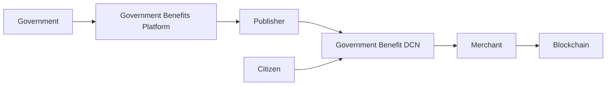

# Government Benefits

> _The DCN Standard enables governments to distribute public funds, welfare programs, subsidies, pensions, and emergency assistance through secure Physical Digital Assets. By combining cryptographic security, programmable policies, and interoperable infrastructure, governments can deliver benefits more efficiently, transparently, and inclusively._

***

## Introduction

Governments worldwide administer thousands of public benefit programs.

Examples include:

* Social welfare
* Pension payments
* Food assistance
* Healthcare subsidies
* Agricultural subsidies
* Education grants
* Disaster relief
* Unemployment assistance
* Housing support
* Child benefit programs

Traditional distribution methods often rely on:

* Paper vouchers
* Bank transfers
* Manual verification
* Plastic benefit cards
* Cash distribution

These systems may face challenges such as:

* Fraud
* Duplicate claims
* Administrative complexity
* Slow distribution
* Limited transparency
* High operational costs

The DCN Standard modernizes public benefit distribution by introducing **Government Benefit Physical Digital Assets** that are secure, programmable, and interoperable.

***

## Vision

The objective is to enable governments to deliver public benefits that are:

* Secure
* Transparent
* Easy to use
* Fast to distribute
* Difficult to counterfeit
* Easy to audit
* Accessible to citizens

A citizen should be able to receive, manage, and use government assistance with the same simplicity as carrying a physical card while benefiting from digital security.

***

## Government Benefits Architecture



The government authorizes benefits, while the Publisher Platform manages issuance, lifecycle, and policy enforcement.

***

## Supported Programs

The DCN Standard can support a broad range of public programs.

#### Financial Assistance

* Social welfare
* Basic income
* Pension payments
* Disability assistance

***

#### Food Programs

* Food vouchers
* Nutrition assistance
* School meal benefits

***

#### Healthcare

* Medical assistance
* Pharmacy subsidies
* Insurance support
* Healthcare credits

***

#### Education

* Scholarships
* Student allowances
* Digital learning grants

***

#### Agriculture

* Fertilizer subsidies
* Seed assistance
* Farm equipment support
* Crop incentive programs

***

#### Emergency Relief

* Disaster recovery payments
* Humanitarian aid
* Refugee assistance
* Emergency financial support

Each program may use different spending policies while sharing the same DCN infrastructure.

***

## Programmable Benefits

The **DCN-P (Programmable)** asset profile allows governments to define policy rules.

Examples include:

* Spending only at approved merchants
* Category-specific purchases
* Geographic restrictions
* Time-limited validity
* Maximum daily spending
* Restricted transferability
* Automatic expiry after program completion

These rules are enforced digitally while remaining transparent and auditable.

***

## Citizen Experience

A typical citizen journey is straightforward.

1. Government approves benefit.
2. Benefit is issued to the citizen's Government Benefit DCN.
3. Citizen receives a notification.
4. Citizen taps the card or note at participating merchants.
5. Merchant verifies authenticity and eligibility.
6. Payment is completed.
7. Remaining balance is updated automatically.

The process is designed to be simple and familiar, even for citizens with limited digital literacy.

***

## Government Dashboard

Government agencies may monitor benefit programs through a centralized dashboard.

```
Government Dashboard

├── Active Programs
├── Total Beneficiaries
├── Funds Distributed
├── Redemption Statistics
├── Fraud Alerts
├── Regional Analytics
├── Program Performance
├── Merchant Network
├── Compliance Reports
└── Audit Logs
```

This provides real-time visibility into program performance and fund utilization.

***

## Transparency & Auditability

The DCN ecosystem provides comprehensive audit capabilities.

Authorities can track:

* Benefit issuance
* Redemption events
* Lifecycle changes
* Program utilization
* Suspicious activity
* Policy compliance

This supports stronger governance while reducing administrative overhead.

***

## Financial Inclusion

Government Benefits are often targeted toward vulnerable populations.

The DCN Standard supports financial inclusion by providing:

* Simple tap-to-use interaction
* Reduced dependence on smartphones
* Secure Physical Digital Assets
* Familiar payment experience
* Support for remote and underserved communities
* Integration with national digital identity systems where applicable

These characteristics can improve access to public services while reducing operational complexity.

***

## Security

Government Benefit products inherit the complete DCN Security Architecture.

Security mechanisms include:

* Secure Element
* Hardware Root of Trust
* Device Certificates
* Mutual Authentication
* Secure Messaging
* Lifecycle Management
* Revocation Services
* Ownership Verification

These protections help safeguard public funds and reduce fraud.

***

## Business & Operational Benefits

Governments benefit from:

| Benefit                    | Description                              |
| -------------------------- | ---------------------------------------- |
| Faster Distribution        | Immediate digital issuance               |
| Reduced Fraud              | Cryptographic verification               |
| Better Transparency        | Real-time reporting                      |
| Policy Enforcement         | Programmable spending rules              |
| Lower Administrative Costs | Standardized infrastructure              |
| Interoperability           | Common platform across multiple programs |

***

## Example Programs

```
Government Benefit Programs

├── Pension Card
├── Welfare Card
├── Food Assistance Card
├── Student Grant Card
├── Healthcare Benefit Card
├── Agricultural Subsidy Card
├── Disaster Relief Card
└── Universal Benefit Wallet
```

A single government can manage multiple public programs using one interoperable Publisher Platform.

***

## Future Evolution

Future Government Benefit programs may include:

* CBDC-based public assistance
* AI-assisted fraud detection
* Dynamic policy adjustments
* Smart City integrations
* Digital identity integration
* Cross-border humanitarian aid
* Real-time benefit analytics
* Machine-readable public credentials

These capabilities can evolve while maintaining compatibility with the DCN Standard.

***

## Design Principles

Government Benefit implementations follow five principles.

#### Secure

Protected through certified hardware and cryptographic verification.

#### Inclusive

Accessible to citizens with diverse levels of digital access and technical experience.

#### Transparent

Supports comprehensive reporting and audit capabilities.

#### Programmable

Benefit policies can be digitally enforced.

#### Interoperable

Compatible with compliant wallets, merchants, and government systems.

***

## Summary

The DCN Standard enables governments to modernize public benefit distribution through secure Physical Digital Assets.

By combining trusted hardware, programmable policy enforcement, standardized verification, and interoperable infrastructure, governments can deliver welfare, pensions, subsidies, emergency assistance, and other public services more securely, efficiently, and transparently while improving accessibility for citizens.
