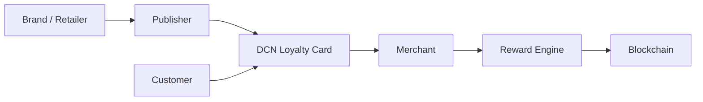

# Loyalty

> _The DCN Standard transforms traditional loyalty programs into secure, programmable Physical Digital Assets. Instead of isolated reward systems, organizations can create interoperable loyalty ecosystems where points, rewards, memberships, and promotional benefits are securely managed through trusted hardware and standardized infrastructure._

***

## Introduction

Customer loyalty is one of the largest business sectors worldwide.

Companies invest billions every year into:

* Reward Points
* Cashback Programs
* Membership Cards
* Airline Miles
* Hotel Rewards
* Retail Loyalty
* Fuel Rewards
* Coffee Shop Programs
* Shopping Clubs
* VIP Memberships

Despite their popularity, most loyalty systems are fragmented.

Customers often carry:

* Multiple plastic cards
* Different mobile applications
* Separate usernames
* Independent reward balances

Each business operates its own isolated infrastructure.

The DCN Standard introduces a **universal loyalty platform** where rewards become secure Physical Digital Assets that can be easily managed, verified, and redeemed.

***

## Vision

The goal is to create loyalty programs that are:

* Secure
* Easy to use
* Transferable (where permitted)
* Programmable
* Multi-brand
* Interoperable
* Blockchain-enabled
* Customer friendly

Customers should be able to carry one trusted Physical Digital Asset that securely manages multiple loyalty programs.

***

## Loyalty Architecture



The Publisher manages loyalty assets while merchants and reward engines process earning and redemption.

***

## Loyalty Models

The DCN Standard supports many loyalty structures.

#### Points Program

Customers earn reward points for purchases.

***

#### Cashback

A percentage of purchases is credited back to the customer.

***

#### Membership

Digital memberships with tier-based benefits.

***

#### Subscription Rewards

Exclusive benefits for subscribers.

***

#### Coalition Loyalty

Multiple brands participate in one shared loyalty ecosystem.

***

#### Enterprise Rewards

Internal employee recognition and incentive programs.

***

## Reward Lifecycle


Each stage is managed through the Publisher Platform while maintaining a complete audit trail.

***

## Programmable Rewards

Using **DCN-P**, loyalty programs may implement advanced business rules.

Examples include:

* Product-specific rewards
* Merchant restrictions
* Seasonal campaigns
* Birthday rewards
* Geographic promotions
* Tier upgrades
* Limited-time offers
* Partner-only promotions

Business logic is enforced automatically by the platform.

***

## Customer Experience

A typical customer journey is simple.

1. Customer taps the Loyalty DCN during purchase.
2. Merchant verifies authenticity.
3. Reward points are calculated.
4. Balance updates instantly.
5. Customer redeems rewards when eligible.
6. Remaining points remain securely stored.

The process requires no paper coupons or manual code entry.

***

## Multi-Brand Loyalty

One Physical Digital Asset can manage rewards from multiple organizations.

```
DCN Loyalty Wallet

├── Airline Miles
├── Hotel Rewards
├── Retail Points
├── Coffee Rewards
├── Fuel Cashback
├── Shopping Mall Rewards
├── Entertainment Club
└── Restaurant Membership
```

Customers enjoy a unified loyalty experience while brands retain independent programs.

***

## Business Benefits

Organizations gain significant advantages.

| Benefit                 | Description                                |
| ----------------------- | ------------------------------------------ |
| Customer Retention      | Encourage repeat purchases                 |
| Reduced Fraud           | Secure cryptographic verification          |
| Unified Platform        | Multiple programs on one infrastructure    |
| Real-Time Rewards       | Instant earning and redemption             |
| Customer Analytics      | Better engagement insights                 |
| Lower Operational Costs | Standardized APIs and lifecycle management |

***

## Enterprise Integration

The Loyalty Platform integrates with:

* CRM systems
* POS platforms
* E-commerce platforms
* Mobile applications
* ERP systems
* Marketing automation
* Customer analytics
* Payment gateways

The standardized API architecture simplifies deployment across existing enterprise systems.

***

## Example Loyalty Products

```
Loyalty Portfolio

├── Retail Rewards
├── Airline Miles
├── Hotel Membership
├── Coffee Club
├── Fuel Rewards
├── Shopping Mall Rewards
├── Gaming Membership
├── Restaurant Rewards
└── Corporate Recognition Program
```

A single Publisher Platform can manage numerous loyalty products across industries.

***

## Future Evolution

Future loyalty capabilities may include:

* AI-personalized offers
* Dynamic reward pricing
* Cross-brand loyalty exchanges
* Tokenized loyalty assets
* NFT achievement badges
* Smart promotional campaigns
* Gamified customer engagement
* Global coalition reward networks

These innovations can be introduced without changing the core DCN architecture.

***

## Design Principles

Loyalty implementations follow five principles.

#### Customer-Centric

Designed to simplify and enhance customer engagement.

#### Secure

Protected through certified hardware and cryptographic verification.

#### Programmable

Supports flexible reward policies and promotional campaigns.

#### Interoperable

Works across compliant wallets, merchants, and Publisher platforms.

#### Scalable

Supports local businesses, national brands, and international loyalty ecosystems.

***

## Summary

The DCN Standard transforms traditional loyalty programs into secure, programmable Physical Digital Assets.

By combining trusted hardware, standardized verification, interoperable APIs, and flexible reward policies, organizations can build next-generation loyalty ecosystems that improve customer engagement, reduce operational complexity, and create new opportunities for collaboration across brands and industries.
