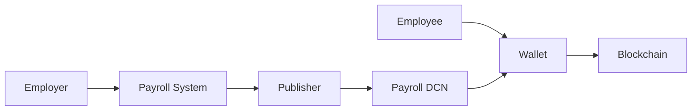
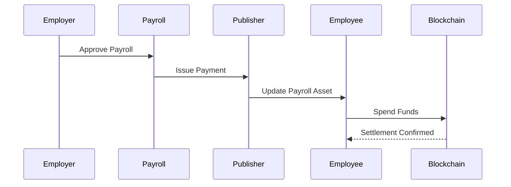

# Payroll

> _The DCN Standard enables organizations to distribute salaries, wages, bonuses, and employee benefits through secure Physical Digital Assets. Payroll becomes programmable, instant, interoperable, and globally accessible while maintaining compliance with enterprise policies and applicable financial regulations._

***

## Introduction

Payroll is one of the most fundamental financial operations performed by every organization.

Every month, employers transfer billions of dollars in:

* Salaries
* Wages
* Bonuses
* Incentives
* Expense reimbursements
* Travel allowances
* Meal benefits
* Performance rewards

Today's payroll systems typically rely on:

* Bank transfers
* Payroll accounts
* Paper checks
* Payroll cards
* Third-party payment providers

While effective, these systems often involve:

* Banking delays
* High cross-border costs
* Multiple intermediaries
* Limited programmability
* Fragmented employee benefit systems

The DCN Standard modernizes payroll by enabling organizations to issue **Payroll Physical Digital Assets**, allowing employees to receive and manage digital value through secure hardware backed by blockchain infrastructure.

***

## Vision

The goal is to make payroll:

* Faster
* More secure
* Globally accessible
* Easier to manage
* Programmable
* Multi-currency
* Blockchain compatible

Employees should receive salary as easily as receiving a traditional payroll card while benefiting from the flexibility of digital assets.

***

## Payroll Architecture



The employer authorizes payroll, the Publisher issues or updates the Physical Digital Asset, and blockchain infrastructure records settlement.

***

## Payroll Models

The DCN Standard supports multiple payroll structures.

#### Fixed Salary

Monthly salary deposited into a Payroll Physical Digital Asset.

***

#### Hourly Wages

Funds credited based on approved working hours.

***

#### Gig Economy

Instant payments after completed work.

Ideal for:

* Freelancers
* Delivery workers
* Drivers
* Contractors
* Temporary workers

***

#### Bonuses

Performance incentives distributed instantly.

***

#### Employee Benefits

Separate programmable balances for:

* Meals
* Fuel
* Travel
* Healthcare
* Learning
* Wellness

Each benefit may have independent spending policies.

***

## Payroll Asset Profiles

Different DCN asset types support different payroll strategies.

| Asset Profile | Payroll Example                              |
| ------------- | -------------------------------------------- |
| DCN-S         | One-time salary voucher                      |
| DCN-R         | Reloadable salary card                       |
| DCN-P         | Benefit-specific programmable payroll        |
| DCN-C         | Employee recognition or commemorative awards |

Most payroll deployments will utilize **DCN-R** combined with **DCN-P**.

***

## Payroll Distribution Flow



The employee receives value directly into their Physical Digital Asset while blockchain settlement remains transparent and auditable.

***

## Employee Experience

A typical payroll experience is straightforward.

1. Salary is approved.
2. Funds are loaded onto the employee's Payroll DCN.
3. Employee receives a notification.
4. Employee checks balance in the Companion Wallet.
5. Employee taps the Payroll DCN to make purchases or transfers.
6. Remaining balance updates automatically.

No bank visit or paper documentation is required for everyday use.

***

## Cross-Border Payroll

Global employers often face challenges with international payroll.

The DCN Standard can simplify payroll for:

* Remote employees
* International contractors
* Maritime workers
* Airline crews
* Global consulting firms
* Technology companies

Potential benefits include:

* Faster settlement
* Reduced intermediaries
* Multi-currency support
* Standardized verification
* Unified payroll infrastructure

Deployment must comply with local labor, tax, and financial regulations.

***

## Enterprise Integration

Payroll APIs integrate with existing enterprise software.

Examples include:

* SAP SuccessFactors
* Oracle HCM
* Workday
* BambooHR
* Microsoft Dynamics
* ERP platforms
* Accounting software

The Publisher Platform synchronizes payroll data through standardized APIs without requiring organizations to replace existing HR systems.

***

## Programmable Payroll

Using **DCN-P**, employers may define spending rules for specific benefits.

Examples include:

* Meal allowance usable only at food merchants
* Fuel allowance usable only at fuel stations
* Travel budget valid during business trips
* Wellness credits redeemable at approved healthcare providers
* Training budget restricted to educational platforms

These policies are enforced automatically by the DCN ecosystem.

***

## Security

Payroll Physical Digital Assets inherit the complete DCN Security Architecture.

Security capabilities include:

* Secure Element
* Hardware Root of Trust
* Mutual Authentication
* Device Certificates
* Secure Messaging
* Lifecycle Management
* Ownership Verification
* Recovery Support

These protections reduce the risk of fraud and unauthorized access.

***

## Business Opportunities

Payroll solutions built on the DCN Standard can be offered by:

* Payroll service providers
* Banks
* FinTech companies
* HR software vendors
* Enterprise SaaS providers
* Stablecoin issuers
* Government agencies
* Employer consortiums

Each organization can build differentiated payroll products while remaining interoperable with the global DCN ecosystem.

***

## Example Product Portfolio

```
Payroll Products

├── Employee Salary Card
├── Contractor Payment Card
├── Gig Worker Wallet
├── Expense Card
├── Meal Benefit Card
├── Travel Benefit Card
├── Bonus Card
└── Executive Multi-Currency Payroll Card
```

A single Publisher Platform can manage multiple payroll products for different workforce categories.

***

## Future Evolution

Future payroll capabilities may include:

* Real-time earned wage access
* Daily salary settlement
* AI-powered payroll optimization
* Cross-chain payroll routing
* Tokenized employee incentives
* Multi-country payroll management
* Embedded tax reporting
* Smart employment contracts

These innovations can be introduced while preserving compatibility with the DCN Standard.

***

## Design Principles

Payroll implementations using the DCN Standard follow five principles.

#### Secure

Protected through certified hardware and cryptographic verification.

#### Efficient

Automates payroll distribution and reduces operational overhead.

#### Programmable

Supports benefit-specific spending policies and business rules.

#### Interoperable

Integrates with existing HR, ERP, and payroll infrastructure.

#### Inclusive

Supports local and cross-border workforce payment models.

***

## Summary

The DCN Standard transforms payroll into a secure, programmable, and interoperable digital payment system.

By combining trusted hardware, standardized APIs, blockchain-neutral settlement, and flexible asset profiles, organizations can modernize salary distribution, employee benefits, and workforce payments while improving efficiency, enhancing security, and creating a better financial experience for employees around the world.
