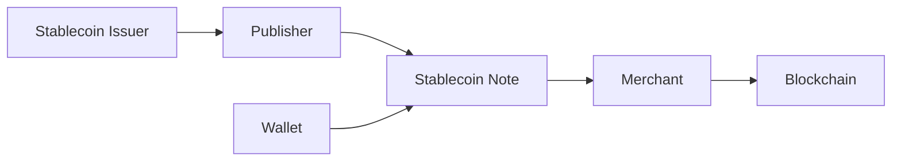
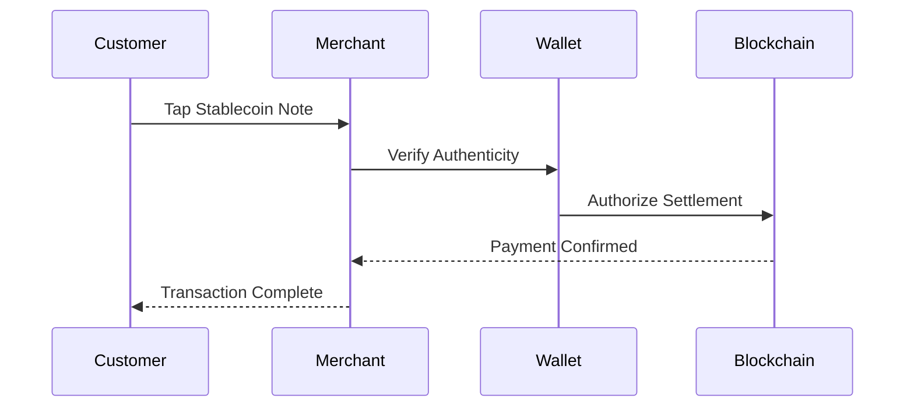

# Stablecoin Notes

> _Stablecoin Notes are Physical Digital Assets that represent blockchain-based stablecoins in a secure physical form. They combine the price stability of fiat-backed digital currencies with the convenience of physical cash, enabling users to hold, transfer, and spend stablecoins through trusted NFC-enabled notes._

***

## Introduction

Stablecoins have become one of the fastest-growing segments of the digital asset industry.

They are used for:

* Cross-border payments
* Digital commerce
* Savings
* Remittances
* Payroll
* Merchant settlement
* Treasury management
* Decentralized Finance (DeFi)

Despite their growth, stablecoins remain primarily **software-based assets**.

Users are still required to:

* Install wallets
* Manage private keys
* Scan QR codes
* Understand blockchain networks
* Pay network fees
* Navigate complex interfaces

The DCN Standard introduces **Stablecoin Notes**, allowing stablecoins to be experienced like physical money while preserving blockchain security and ownership.

***

## Vision

A Stablecoin Note should feel as familiar as holding a banknote.

Instead of carrying paper currency, users carry a secure Physical Digital Asset representing digital value.

Examples include:

* USD Stablecoin Note
* EUR Stablecoin Note
* AED Stablecoin Note
* GBP Stablecoin Note
* INR Stablecoin Note (where permitted)
* Gold-backed Stablecoin Note
* Commodity-backed Stablecoin Note

Each note represents blockchain-based value while remaining interoperable across the DCN ecosystem.

***

## Stablecoin Note Architecture



The Publisher issues the Physical Digital Asset, while the underlying stablecoin remains recorded on the blockchain.

***

## Types of Stablecoin Notes

The DCN Standard supports multiple stablecoin models.

#### Fiat-Backed

Examples:

* USD-backed
* EUR-backed
* AED-backed

***

#### Commodity-Backed

Examples:

* Gold-backed
* Silver-backed

***

#### Treasury-Backed

Issued against regulated financial reserves.

***

#### Algorithmic

Supported where permitted by Publisher policy and applicable regulations.

***

#### Enterprise Stablecoins

Private settlement assets used within organizations or commercial ecosystems.

***

## Asset Profiles

Stablecoin Notes can be issued using different DCN asset profiles.

| Asset Profile | Typical Use                                                  |
| ------------- | ------------------------------------------------------------ |
| DCN-S         | Fixed denomination notes                                     |
| DCN-R         | Reloadable payment wallet                                    |
| DCN-P         | Programmable spending policies                               |
| DCN-C         | Limited-edition or commemorative issues with spendable value |

This flexibility allows Publishers to create products for different customer segments.

***

## Denomination Models

Stablecoin Notes may be issued as:

#### Fixed Denomination

```
10 USDC

20 USDC

50 USDC

100 USDC

500 USDC
```

Ideal for cash-like circulation.

***

#### Reloadable

Users may add or remove funds while retaining the same Physical Digital Asset.

Suitable for everyday spending and long-term use.

***

## Payment Flow



The user experiences a simple tap, while the wallet and blockchain handle settlement in the background.

***

## Cross-Border Payments

Stablecoin Notes are particularly valuable for international commerce.

Potential applications include:

* International tourism
* Remittances
* Cross-border retail
* Freelance payments
* Business travel
* Global merchant acceptance

A traveler carrying a USD Stablecoin Note can transact without exchanging physical cash, subject to local laws and merchant acceptance.

***

## Merchant Benefits

Merchants gain several advantages.

* Fast settlement
* Reduced cash handling
* Lower reconciliation effort
* Blockchain transparency
* Multi-chain compatibility
* Standardized acceptance

The Merchant SDK abstracts blockchain complexity from the payment process.

***

## Publisher Opportunities

Publishers can create differentiated products.

Examples include:

* Consumer payment notes
* Corporate treasury notes
* Payroll notes
* Travel payment notes
* Family spending cards
* Student payment cards
* Festival payment notes

All products share the same DCN infrastructure while serving different markets.

***

## Security

Stablecoin Notes inherit the full DCN Security Architecture.

Security features include:

* Secure Element
* Hardware Root of Trust
* Device Certificates
* Mutual Authentication
* Secure Messaging
* Verification Services
* Revocation Support
* Lifecycle Management

These mechanisms help protect against cloning, counterfeiting, and unauthorized use.

***

## Example Product Portfolio

```
Global Stablecoin Products

├── USD Note
├── EUR Note
├── AED Note
├── GBP Note
├── Gold Note
├── Reloadable Travel Note
├── Corporate Treasury Note
└── Payroll Note
```

A single Publisher Platform can manage multiple stablecoin products across different blockchain networks.

***

## Business Opportunities

Stablecoin Notes create opportunities for:

* Stablecoin issuers
* Banks
* Exchanges
* Payment providers
* FinTech companies
* Payroll providers
* Travel companies
* International merchants

These organizations can launch branded Physical Digital Asset products while remaining interoperable with the DCN ecosystem.

***

## Future Evolution

Future Stablecoin Notes may support:

* Multi-currency balances
* Automatic foreign exchange
* Yield-bearing stablecoins
* Offline payment capabilities
* AI-assisted treasury management
* Cross-chain liquidity routing
* Programmable business rules

These capabilities can be introduced without changing the underlying DCN architecture.

***

## Design Principles

Stablecoin Notes follow five principles.

#### Stable

Designed around assets intended to minimize price volatility.

#### Familiar

Provide a cash-like user experience.

#### Secure

Protected by the DCN Security Architecture.

#### Multi-Chain

Compatible with any supported blockchain through the Blockchain Adapter SDK.

#### Interoperable

Accepted across compliant wallets, merchants, and Publisher platforms.

***

## Summary

Stablecoin Notes extend the benefits of blockchain-based stablecoins into the physical world.

By combining trusted Secure Hardware, standardized verification, blockchain-neutral settlement, and familiar cash-like usability, the DCN Standard enables stablecoins to become practical Physical Digital Assets for consumers, businesses, and governments worldwide.

> _Stablecoin Notes are Physical Digital Assets that represent blockchain-based stablecoins in a secure physical form. They combine the price stability of fiat-backed digital currencies with the convenience of physical cash, enabling users to hold, transfer, and spend stablecoins through trusted NFC-enabled notes._

***

## Introduction

Stablecoins have become one of the fastest-growing segments of the digital asset industry.

They are used for:

* Cross-border payments
* Digital commerce
* Savings
* Remittances
* Payroll
* Merchant settlement
* Treasury management
* Decentralized Finance (DeFi)

Despite their growth, stablecoins remain primarily **software-based assets**.

Users are still required to:

* Install wallets
* Manage private keys
* Scan QR codes
* Understand blockchain networks
* Pay network fees
* Navigate complex interfaces

The DCN Standard introduces **Stablecoin Notes**, allowing stablecoins to be experienced like physical money while preserving blockchain security and ownership.

***

## Vision

A Stablecoin Note should feel as familiar as holding a banknote.

Instead of carrying paper currency, users carry a secure Physical Digital Asset representing digital value.

Examples include:

* USD Stablecoin Note
* EUR Stablecoin Note
* AED Stablecoin Note
* GBP Stablecoin Note
* INR Stablecoin Note (where permitted)
* Gold-backed Stablecoin Note
* Commodity-backed Stablecoin Note

Each note represents blockchain-based value while remaining interoperable across the DCN ecosystem.

***

## Stablecoin Note Architecture


The Publisher issues the Physical Digital Asset, while the underlying stablecoin remains recorded on the blockchain.

***

## Types of Stablecoin Notes

The DCN Standard supports multiple stablecoin models.

#### Fiat-Backed

Examples:

* USD-backed
* EUR-backed
* AED-backed

***

#### Commodity-Backed

Examples:

* Gold-backed
* Silver-backed

***

#### Treasury-Backed

Issued against regulated financial reserves.

***

#### Algorithmic

Supported where permitted by Publisher policy and applicable regulations.

***

#### Enterprise Stablecoins

Private settlement assets used within organizations or commercial ecosystems.

***

## Asset Profiles

Stablecoin Notes can be issued using different DCN asset profiles.

| Asset Profile | Typical Use                                                  |
| ------------- | ------------------------------------------------------------ |
| DCN-S         | Fixed denomination notes                                     |
| DCN-R         | Reloadable payment wallet                                    |
| DCN-P         | Programmable spending policies                               |
| DCN-C         | Limited-edition or commemorative issues with spendable value |

This flexibility allows Publishers to create products for different customer segments.

***

## Denomination Models

Stablecoin Notes may be issued as:

#### Fixed Denomination

```
10 USDC

20 USDC

50 USDC

100 USDC

500 USDC
```

Ideal for cash-like circulation.

***

#### Reloadable

Users may add or remove funds while retaining the same Physical Digital Asset.

Suitable for everyday spending and long-term use.

***

## Payment Flow


The user experiences a simple tap, while the wallet and blockchain handle settlement in the background.

***

## Cross-Border Payments

Stablecoin Notes are particularly valuable for international commerce.

Potential applications include:

* International tourism
* Remittances
* Cross-border retail
* Freelance payments
* Business travel
* Global merchant acceptance

A traveler carrying a USD Stablecoin Note can transact without exchanging physical cash, subject to local laws and merchant acceptance.

***

## Merchant Benefits

Merchants gain several advantages.

* Fast settlement
* Reduced cash handling
* Lower reconciliation effort
* Blockchain transparency
* Multi-chain compatibility
* Standardized acceptance

The Merchant SDK abstracts blockchain complexity from the payment process.

***

## Publisher Opportunities

Publishers can create differentiated products.

Examples include:

* Consumer payment notes
* Corporate treasury notes
* Payroll notes
* Travel payment notes
* Family spending cards
* Student payment cards
* Festival payment notes

All products share the same DCN infrastructure while serving different markets.

***

## Security

Stablecoin Notes inherit the full DCN Security Architecture.

Security features include:

* Secure Element
* Hardware Root of Trust
* Device Certificates
* Mutual Authentication
* Secure Messaging
* Verification Services
* Revocation Support
* Lifecycle Management

These mechanisms help protect against cloning, counterfeiting, and unauthorized use.

***

## Example Product Portfolio

```
Global Stablecoin Products

├── USD Note
├── EUR Note
├── AED Note
├── GBP Note
├── Gold Note
├── Reloadable Travel Note
├── Corporate Treasury Note
└── Payroll Note
```

A single Publisher Platform can manage multiple stablecoin products across different blockchain networks.

***

## Business Opportunities

Stablecoin Notes create opportunities for:

* Stablecoin issuers
* Banks
* Exchanges
* Payment providers
* FinTech companies
* Payroll providers
* Travel companies
* International merchants

These organizations can launch branded Physical Digital Asset products while remaining interoperable with the DCN ecosystem.

***

## Future Evolution

Future Stablecoin Notes may support:

* Multi-currency balances
* Automatic foreign exchange
* Yield-bearing stablecoins
* Offline payment capabilities
* AI-assisted treasury management
* Cross-chain liquidity routing
* Programmable business rules

These capabilities can be introduced without changing the underlying DCN architecture.

***

## Design Principles

Stablecoin Notes follow five principles.

#### Stable

Designed around assets intended to minimize price volatility.

#### Familiar

Provide a cash-like user experience.

#### Secure

Protected by the DCN Security Architecture.

#### Multi-Chain

Compatible with any supported blockchain through the Blockchain Adapter SDK.

#### Interoperable

Accepted across compliant wallets, merchants, and Publisher platforms.

***

## Summary

Stablecoin Notes extend the benefits of blockchain-based stablecoins into the physical world.

By combining trusted Secure Hardware, standardized verification, blockchain-neutral settlement, and familiar cash-like usability, the DCN Standard enables stablecoins to become practical Physical Digital Assets for consumers, businesses, and governments worldwide.
