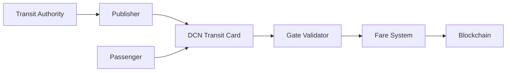

# Transit

> _The DCN Standard enables public transportation systems to issue secure Physical Digital Assets for fare collection, ticketing, subscriptions, and mobility services. By combining secure hardware, programmable policies, and interoperable infrastructure, transit operators can modernize fare systems while improving passenger experience and operational efficiency._

***

## Introduction

Every day, billions of people use public transportation.

Transit systems include:

* Metro Rail
* Subway
* Bus Networks
* Trams
* Ferries
* High-Speed Rail
* Taxis
* Ride Sharing
* Toll Roads
* Parking Systems

Most transit systems currently depend on:

* Paper tickets
* QR codes
* Closed-loop smart cards
* Mobile applications
* Proprietary NFC systems

These solutions often suffer from:

* Vendor lock-in
* High infrastructure costs
* Poor interoperability
* Card duplication
* Limited integration with other payment systems
* Separate cards for different cities and operators

The DCN Standard introduces a universal Physical Digital Asset that enables secure, interoperable, and programmable transit access.

***

## Vision

The objective is to create a transit experience where passengers simply:

* Tap to enter
* Tap to exit
* Travel
* Tap to pay

The same Physical Digital Asset may also function as:

* A payment card
* A digital identity
* A loyalty card
* A government credential
* A city services card

One trusted asset can support an entire mobility ecosystem.

***

## Transit Architecture



The Publisher issues the transit asset, while fare systems manage journeys and settlement.

***

## Transit Products

The DCN Standard supports multiple transportation products.

#### Stored Value

Passengers preload funds and pay fares as they travel.

Implemented using **DCN-R (Reloadable)**.

***

#### Single Journey Ticket

Valid for one trip.

Implemented using **DCN-S (Stored Value)**.

***

#### Daily Pass

Unlimited travel during a defined period.

***

#### Monthly Pass

Subscription-based access.

***

#### Annual Membership

Long-term mobility programs.

***

#### Multi-Modal Pass

One asset supporting:

* Metro
* Bus
* Ferry
* Parking
* Bike Sharing
* Toll Roads

***

## Passenger Experience

A typical journey is straightforward.

1. Passenger taps the Transit DCN at entry.
2. Gate validates authenticity.
3. Access is granted.
4. Passenger completes the journey.
5. Passenger taps at exit (where applicable).
6. Fare is calculated.
7. Wallet balance is updated.

The interaction is completed within milliseconds to support high passenger throughput.

***

## Fare Models

Transit operators may implement various pricing strategies.

Examples include:

* Flat fares
* Distance-based pricing
* Zone-based pricing
* Peak-hour pricing
* Off-peak discounts
* Student fares
* Senior citizen concessions
* Tourist passes

The **DCN-P (Programmable)** profile enables these fare policies without changing the underlying infrastructure.

***

## Mobility Integration

The same Transit DCN may also support:

* Parking payments
* Toll collection
* Bike rentals
* Electric vehicle charging
* Airport shuttles
* Ferry services
* Ride-sharing partnerships

This creates a unified mobility platform rather than isolated transportation systems.

***

## Security

Transit assets inherit the complete DCN Security Architecture.

Security features include:

* Secure Element
* Hardware Root of Trust
* Mutual Authentication
* Device Certificates
* Secure Messaging
* Lifecycle Management
* Revocation Services
* Anti-counterfeit protection

These mechanisms reduce fraud while maintaining rapid transaction speeds.

***

## Transit Operator Benefits

Operators gain significant operational improvements.

| Benefit                 | Description                    |
| ----------------------- | ------------------------------ |
| Faster Passenger Flow   | Rapid NFC authentication       |
| Reduced Fraud           | Cryptographic verification     |
| Lower Operational Costs | Standardized infrastructure    |
| Multi-Operator Support  | Shared interoperability        |
| Flexible Fare Policies  | Programmable pricing           |
| Real-Time Analytics     | Passenger and revenue insights |

***

## Smart City Integration

Transit becomes part of a larger digital city ecosystem.

```
Smart City Card

├── Metro
├── Bus
├── Ferry
├── Parking
├── Toll Roads
├── Public Bicycle
├── EV Charging
├── Museum Entry
├── Government Services
└── Digital Payments
```

One Physical Digital Asset can serve multiple public services.

***

## Example Products

```
Transit Products

├── Metro Pass
├── City Bus Card
├── Tourist Pass
├── Monthly Commuter Card
├── Student Transit Card
├── Senior Citizen Card
├── Multi-City Mobility Pass
└── Smart City Card
```

Publishers can issue multiple transportation products using a single platform.

***

## Future Evolution

Future transit capabilities may include:

* Dynamic congestion pricing
* AI-powered route incentives
* Carbon reward programs
* Cross-city interoperability
* International mobility passes
* Autonomous vehicle access
* Machine-to-machine transportation payments
* Mobility-as-a-Service (MaaS) integration

These innovations can be added while preserving compatibility with the DCN Standard.

***

## Design Principles

Transit implementations follow five principles.

#### Fast

Optimized for high-volume passenger throughput.

#### Secure

Protected through certified hardware and cryptographic verification.

#### Interoperable

Supports multiple transport operators and mobility services.

#### Programmable

Flexible fare policies and subscription models.

#### Scalable

Suitable for local transit systems and nationwide transportation networks.

***

## Summary

The DCN Standard enables transportation providers to modernize fare collection and mobility services through secure Physical Digital Assets.

By combining trusted hardware, programmable fare policies, standardized verification, and interoperable infrastructure, transit operators can improve passenger experience, reduce fraud, simplify operations, and create integrated mobility ecosystems that extend beyond traditional ticketing.
