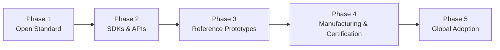
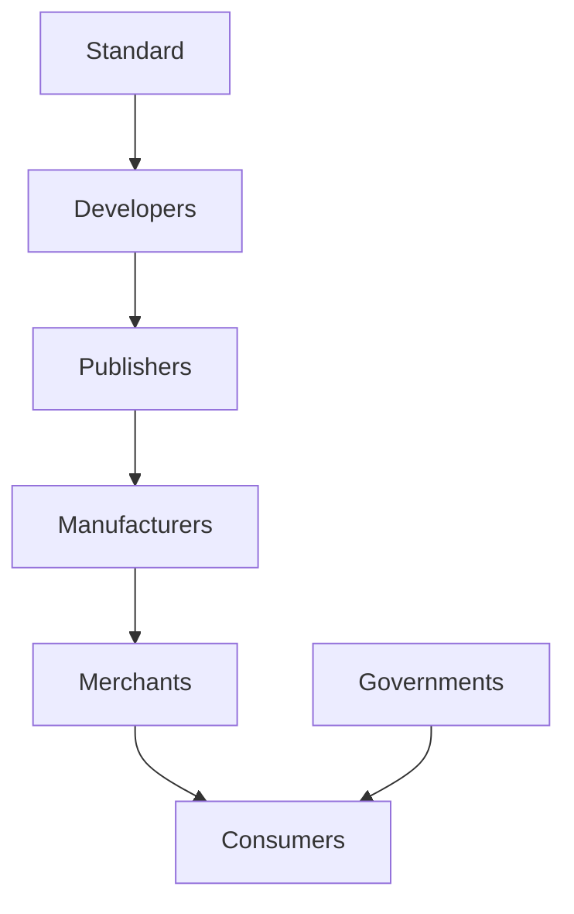

# 21. Roadmap

> _The DCN Roadmap defines the long-term evolution of the Digital Crypto Note ecosystem from an open technical standard into a globally adopted infrastructure for Physical Digital Assets. The roadmap is organized into progressive phases that build upon one another, ensuring interoperability, security, ecosystem growth, and sustainable global adoption._

***

## Introduction

The DCN Standard is more than a specification.

It is a long-term vision for the future of digital ownership.

Creating a global standard requires much more than publishing documentation.

Success depends upon:

* Open specifications
* Reference implementations
* Developer adoption
* Certified hardware
* Manufacturing partnerships
* Publisher ecosystems
* Government collaboration
* Global interoperability

The roadmap presented in this chapter describes how the DCN ecosystem can evolve from an open specification into worldwide infrastructure supporting billions of Physical Digital Assets.

***

## Roadmap Philosophy

The roadmap follows five guiding principles.

#### Build Open First

Standards should be published before products.

***

#### Enable Developers

Developers should receive SDKs and APIs before commercial deployments.

***

#### Validate Through Prototypes

Reference implementations reduce implementation risk and improve interoperability.

***

#### Scale Manufacturing

Certified hardware must become globally available before mass adoption.

***

#### Grow Through Ecosystems

Long-term success depends on independent organizations building interoperable solutions.

***

## Five-Phase Roadmap

The evolution of the DCN ecosystem is divided into five major phases.

Each phase builds upon the achievements of the previous phase while expanding the ecosystem.

***

## Objectives

The roadmap has several long-term objectives.

* Publish an open global standard
* Create a thriving developer ecosystem
* Enable interoperable hardware
* Establish trusted certification
* Encourage ecosystem participation
* Support governments and enterprises
* Build sustainable commercial opportunities
* Promote worldwide adoption

***

## Ecosystem Growth

The roadmap emphasizes ecosystem expansion rather than centralized ownership.

***

## Technology Evolution

As the ecosystem matures, the DCN Standard is expected to incorporate new technologies such as:

* Zero-Knowledge Proofs (ZKP)
* Decentralized Identity (DID)
* Verifiable Credentials (VC)
* AI-assisted verification
* Post-Quantum Cryptography
* Cross-chain interoperability
* Offline payment technologies
* Machine-to-Machine (M2M) commerce
* Smart city infrastructure
* Digital twins

The roadmap is designed to accommodate future innovation while preserving interoperability.

***

## Global Participation

The roadmap encourages participation from:

* Developers
* Hardware manufacturers
* Publishers
* Banks
* Governments
* Universities
* Enterprises
* Standards organizations
* Open-source communities
* Blockchain networks

A diverse ecosystem is essential for long-term sustainability.

***

## Relationship to Following Sections

The remainder of this chapter presents the five phases of ecosystem evolution:

* **Phase 1 — Standard**
* **Phase 2 — SDKs**
* **Phase 3 — Prototype**
* **Phase 4 — Manufacturing**
* **Phase 5 — Global Adoption**

Each phase represents a significant milestone in establishing the DCN Standard as global infrastructure for Physical Digital Assets.

***

## Long-Term Vision

The long-term objective is ambitious.

A future where:

* Every person can own trusted Physical Digital Assets.
* Every merchant can accept interoperable digital value.
* Every government can issue secure digital credentials.
* Every enterprise can modernize identity and payments.
* Every blockchain can participate through standardized adapters.

The DCN Standard becomes the universal bridge between physical objects and digital ownership.

***

## Design Principles

The roadmap follows five principles.

#### Incremental

Each phase builds on proven foundations.

#### Open

The ecosystem remains vendor-neutral and community driven.

#### Secure

Security remains the highest priority throughout every phase.

#### Interoperable

Compatibility is preserved across all implementations.

#### Sustainable

Growth is driven by independent ecosystem participants rather than centralized control.

***

## Summary

The Future Roadmap provides a structured strategy for evolving the DCN Standard from a published specification into a globally adopted ecosystem.

By progressing through open standards, developer tooling, reference implementations, certified manufacturing, and worldwide adoption, the roadmap establishes a practical path toward making Physical Digital Assets a universal component of the global digital economy.

***

## In this chapter

* [Phase 1 — Standard](phase-1-standard.md)
* [Phase 2 — SDKs](phase-2-sdks.md)
* [Phase 3 — Prototype](phase-3-prototype.md)
* [Phase 4 — Manufacturing](phase-4-manufacturing.md)
* [Phase 5 — Global Adoption](phase-5-global-adoption.md)
