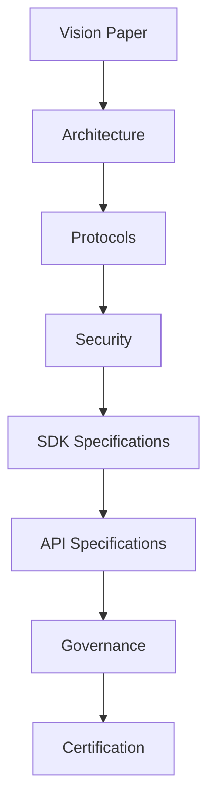

# Phase 1 — Standard

> _Phase 1 establishes the Digital Crypto Note (DCN) Standard as an open, vendor-neutral specification. This phase focuses on defining the architecture, protocols, security model, governance framework, and technical documentation required to create a trusted global foundation for Physical Digital Assets._

***

## Objective

The objective of Phase 1 is **not** to build products.

The objective is to build **the standard**.

Before manufacturers produce hardware...

Before developers write applications...

Before governments issue Digital Cash...

The industry needs a common language.

Just as HTTP standardized the Web and USB standardized hardware connectivity, the DCN Standard defines a universal specification for Physical Digital Assets.

This phase creates that foundation.

***

## Primary Deliverables

Phase 1 focuses on publishing the complete DCN Standard.

Core deliverables include:

* DCN Vision Paper
* Technical Whitepaper
* Protocol Specification
* Security Architecture
* Wallet Architecture
* Publisher Architecture
* Payment Protocol
* Authentication Protocol
* Verification Protocol
* Certificate Infrastructure
* Secure Hardware Specification
* Blockchain Adapter Specification
* API Specification
* SDK Specification
* Governance Framework

Together, these documents define the complete technical and organizational foundation of the ecosystem.

***

## Standard Architecture



Each component contributes to a complete and interoperable specification.

***

## Technical Specifications

The Foundation publishes standardized specifications covering:

```
DCN Specifications

├── Physical Digital Asset Format
├── Secure Element Requirements
├── NFC Communication
├── Wallet Architecture
├── Publisher Architecture
├── Payment Protocol
├── Verification Protocol
├── Certificate Infrastructure
├── Blockchain Adapter Interface
├── API Standards
├── SDK Standards
└── Governance Framework
```

Every future implementation references these specifications.

***

## Open Documentation

All documentation should be publicly available.

Documentation may include:

* GitBook documentation
* Technical specifications
* Architecture diagrams
* Sequence diagrams
* API documentation
* SDK guides
* Developer tutorials
* Security guidelines
* Compliance requirements
* Certification procedures

Comprehensive documentation accelerates ecosystem adoption.

***

## Governance Establishment

During Phase 1, the DCN Foundation establishes:

* Governance policies
* Technical committees
* Security committees
* Certification framework
* Improvement proposal process (DIPs)
* Version management
* Public roadmap

Governance ensures that the standard evolves transparently and responsibly.

***

## Security Baseline

A complete security baseline is established.

Topics include:

* Cryptography
* Secure Hardware
* Authentication
* Certificate Infrastructure
* Hardware Root of Trust
* Anti-counterfeit mechanisms
* Threat models
* Security best practices

Future implementations inherit this security model.

***

## Industry Review

The published specification should be reviewed by:

* Security researchers
* Universities
* Hardware manufacturers
* Wallet providers
* Blockchain developers
* Financial institutions
* Government agencies
* Standards organizations

Public review improves quality and increases confidence.

***

## Community Building

Phase 1 also focuses on creating an open community.

Activities include:

* Technical workshops
* Public discussions
* Open-source collaboration
* Developer forums
* Working groups
* Academic partnerships
* Industry roundtables

Community participation helps ensure the standard reflects real-world requirements.

***

## Success Criteria

Phase 1 is considered successful when:

* The complete specification is published.
* Governance is operational.
* Documentation is publicly accessible.
* Security architecture is finalized.
* APIs and SDK specifications are complete.
* The certification framework is defined.
* The developer community begins implementation.

At this point, the DCN Standard becomes a stable foundation for ecosystem development.

***

## Example Timeline

```
Phase 1

Vision Paper

↓

Technical Specification

↓

Security Review

↓

Governance

↓

Public Release

↓

Community Adoption
```

The exact timeline may vary depending on community participation and technical review.

***

## Long-Term Impact

Completing Phase 1 provides several long-term benefits.

* Common technical language
* Vendor-neutral ecosystem
* Reduced implementation risk
* Improved interoperability
* Strong security foundation
* Accelerated innovation
* Global collaboration

Every subsequent phase depends upon the quality of this foundation.

***

## Design Principles

Phase 1 follows five principles.

#### Open

Specifications are publicly available.

#### Complete

Every major technical component is documented.

#### Secure

Security is integrated into every layer of the architecture.

#### Neutral

The standard remains independent of any single organization or blockchain.

#### Future Ready

Designed to evolve while maintaining backward compatibility.

***

## Summary

Phase 1 establishes the Digital Crypto Note Standard as an open, secure, and interoperable technical foundation.

By publishing comprehensive specifications, governance processes, security architectures, APIs, SDK definitions, and certification requirements, the DCN Foundation creates the common framework upon which developers, manufacturers, publishers, enterprises, and governments can confidently build the next generation of Physical Digital Assets.
