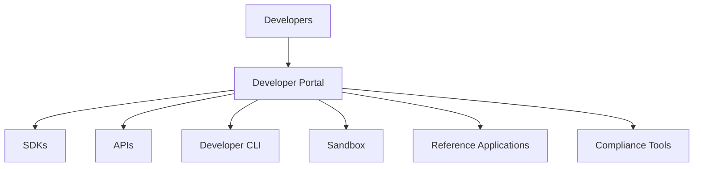

# Phase 2 — SDKs

> _Phase 2 transforms the DCN Standard from a specification into a developer platform by delivering production-ready SDKs, APIs, developer tools, reference libraries, and testing environments. This phase enables developers, enterprises, and ecosystem participants to begin building interoperable Physical Digital Asset applications._

***

## Objective

Once the standard has been published, the next priority is **developer adoption**.

A specification alone cannot build an ecosystem.

Developers require practical tools that simplify implementation and ensure interoperability.

The objective of Phase 2 is to make building on the DCN Standard as simple as building a web application using HTTP or a mobile application using Android or iOS SDKs.

Every major component of the DCN ecosystem should be accessible through well-documented SDKs and APIs.

***

## Primary Deliverables

Phase 2 delivers the complete developer platform.

Key deliverables include:

* DCN Core SDK
* Wallet SDK
* Merchant SDK
* Publisher SDK
* Blockchain Adapter SDK
* REST APIs
* WebSocket APIs
* CLI Tools
* Developer Portal
* API Explorer
* Sandbox Environment
* Sample Applications
* Testing Framework
* Emulator
* Open-source Reference Libraries

These tools reduce development time while ensuring compliance with the DCN Standard.

***

## Developer Platform Architecture



The Developer Portal becomes the central hub for ecosystem development.

***

## SDK Portfolio

The Foundation publishes official SDKs.

```
DCN SDK Portfolio

├── Core SDK
├── Wallet SDK
├── Merchant SDK
├── Publisher SDK
├── Verification SDK
├── Blockchain Adapter SDK
├── Secure Element SDK
├── Hardware Integration SDK
└── Testing SDK
```

Each SDK is designed to solve a specific integration challenge.

***

## Supported Programming Languages

Official SDKs should support major development ecosystems.

Examples include:

#### Backend

* Java
* Go
* Rust
* Node.js
* Python
* .NET

***

#### Mobile

* Android (Kotlin)
* iOS (Swift)
* Flutter
* React Native

***

#### Frontend

* Angular
* React
* Vue.js
* Web Components

***

#### Embedded

* C
* C++
* Rust Embedded

This broad language support encourages adoption across industries.

***

## Developer Tools

Developers should receive modern tooling.

```
Developer Tools

├── CLI
├── API Explorer
├── Emulator
├── Device Simulator
├── Test Wallet
├── Mock Publisher
├── Mock Merchant
├── Blockchain Sandbox
├── Certificate Generator
└── Debug Console
```

These tools enable rapid prototyping without requiring production infrastructure.

***

## Developer Portal

The Developer Portal becomes the official gateway into the ecosystem.

Features include:

* Documentation
* SDK downloads
* Interactive API documentation
* Tutorials
* Architecture guides
* Sample code
* Community forums
* Issue tracker
* Certification resources
* Release notes

The portal should support developers throughout the entire application lifecycle.

***

## Sandbox Environment

A cloud-hosted sandbox allows developers to experiment safely.

Capabilities include:

* Test Publishers
* Test Wallets
* Mock Merchants
* Sample Assets
* Blockchain simulators
* Test certificates
* Verification services
* API playground

Developers can validate integrations before deploying to production.

***

## Reference Applications

The Foundation should publish production-quality reference implementations.

Examples include:

```
Reference Applications

├── Companion Wallet
├── Merchant POS
├── Publisher Portal
├── Verification Service
├── Smart Card Provisioning Tool
├── NFC Reader Application
├── Manufacturing Dashboard
└── Identity Wallet
```

These projects serve as implementation guides rather than mandatory software.

***

## Open-Source Ecosystem

Open-source development accelerates innovation.

Suggested repositories:

* dcn-core
* dcn-wallet-sdk
* dcn-publisher-sdk
* dcn-merchant-sdk
* dcn-adapter-framework
* dcn-cli
* dcn-emulator
* dcn-compliance-tests
* dcn-reference-wallet

Community contributions should be encouraged through transparent governance.

***

## Compliance Testing

Phase 2 introduces developer-focused compliance validation.

Developers should be able to execute:

* API tests
* SDK validation
* Payment simulations
* Authentication tests
* NFC communication tests
* Certificate validation
* Lifecycle testing
* Performance benchmarking

Automated testing improves interoperability before formal certification.

***

## Community Growth

Developer adoption is critical.

Activities may include:

* Hackathons
* Open-source contribution programs
* Developer grants
* Technical webinars
* University partnerships
* Community meetups
* Certification training
* Developer conferences

The objective is to establish a thriving global developer community.

***

## Success Criteria

Phase 2 is considered successful when:

* Official SDKs are publicly available.
* APIs are stable and documented.
* The Developer Portal is operational.
* Sandbox services are online.
* Reference applications are published.
* Open-source repositories are active.
* Developers can independently build compliant DCN applications.

At this point, the ecosystem becomes implementation-ready.

***

## Example Timeline

```
Phase 2

SDK Development

↓

Developer Portal

↓

Sandbox

↓

Reference Apps

↓

Developer Community

↓

Open-Source Ecosystem
```

***

## Long-Term Impact

Completing Phase 2 creates several long-term advantages.

* Faster ecosystem growth
* Lower development costs
* Consistent implementations
* Increased interoperability
* Strong developer engagement
* Rapid innovation
* Global software ecosystem

Every future wallet, Publisher platform, merchant application, and enterprise solution builds upon these developer tools.

***

## Design Principles

Phase 2 follows five principles.

#### Developer First

Developer experience is prioritized.

#### Open

SDKs and documentation are publicly accessible.

#### Modular

Components can be adopted independently.

#### Interoperable

Every SDK follows the same specification.

#### Production Ready

Designed for enterprise-scale deployments.

***

## Summary

Phase 2 transforms the DCN Standard into a complete developer ecosystem.

By delivering production-ready SDKs, APIs, testing tools, reference implementations, and an open developer platform, the Foundation enables organizations worldwide to begin building interoperable Physical Digital Asset applications while accelerating innovation and reducing implementation complexity.
