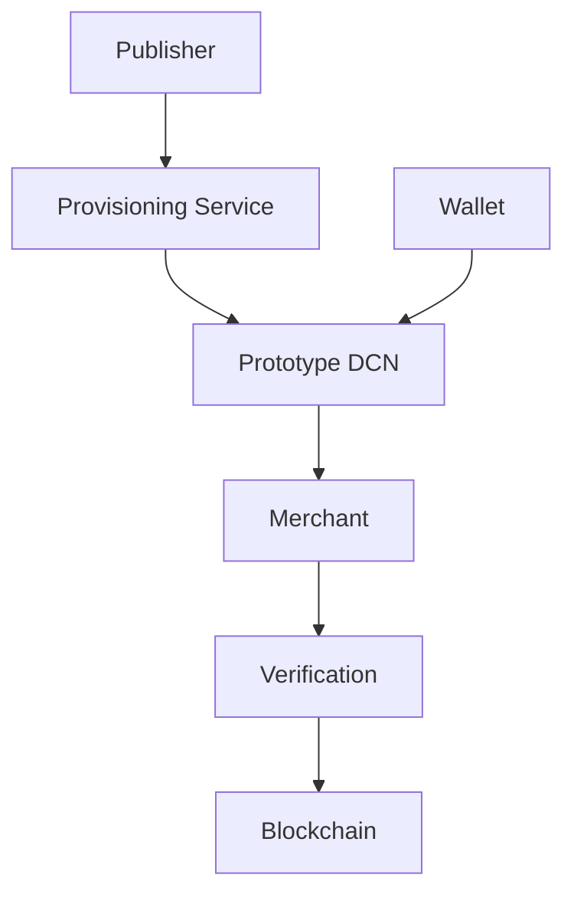
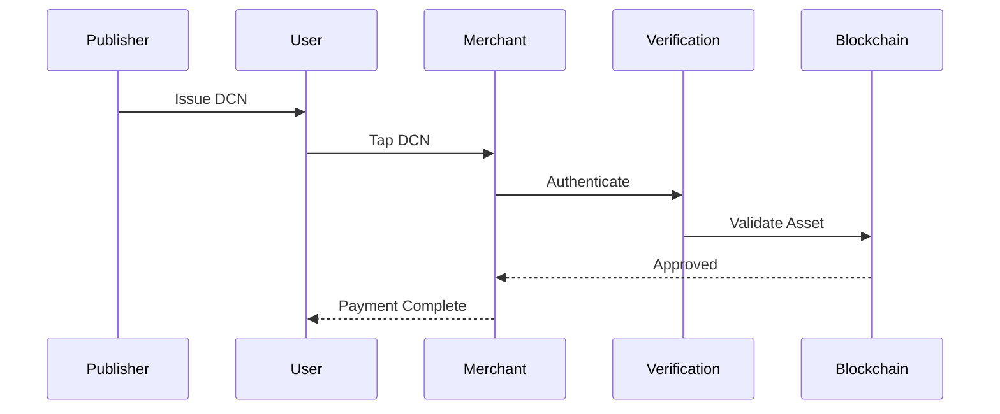

# Phase 3 — Prototype

> _Phase 3 validates the DCN Standard through real-world reference implementations. This phase focuses on building interoperable prototype hardware, software, and infrastructure that demonstrate how Physical Digital Assets operate across wallets, merchants, publishers, and blockchain networks._

***

## Objective

After publishing the standard and delivering developer SDKs, the next milestone is proving that the architecture works in practice.

Phase 3 focuses on building **reference prototypes** rather than commercial products.

These prototypes validate:

* Interoperability
* Security
* Performance
* User experience
* Manufacturing feasibility
* Merchant acceptance
* Blockchain compatibility

The goal is to demonstrate the complete DCN ecosystem from issuance to payment.

***

## Primary Deliverables

Phase 3 produces working reference implementations.

Key deliverables include:

* DCN Companion Wallet
* DCN Publisher Platform
* DCN Merchant POS
* Verification Service
* Secure Element Firmware
* Blockchain Adapter Implementations
* Prototype Digital Crypto Notes
* Prototype Smart Cards
* NFC Reader Software
* Manufacturing Provisioning Tools
* Test Certification Platform

These prototypes become the reference for future certified products.

***

## Prototype Ecosystem



The complete transaction lifecycle can now be demonstrated end-to-end.

***

## Prototype Hardware

Reference hardware may include:

```
Reference Hardware

├── Digital Crypto Note
├── Smart Card
├── Metal Card
├── NFC Tag
├── Key Fob
├── Wearable
├── Secure USB Token
└── Hardware Identity Card
```

Each prototype implements the same DCN Standard.

***

## Prototype Software

Reference software includes:

* Companion Wallet
* Merchant Application
* Publisher Dashboard
* Verification Portal
* Device Provisioning Tool
* Mobile SDK Demo
* Desktop Wallet
* Administration Console

These applications demonstrate practical integration patterns.

***

## Blockchain Validation

Reference adapters should demonstrate interoperability across multiple blockchain networks.

Example prototype integrations:

* Ethereum
* Polygon
* TON
* Solana
* Bitcoin-compatible layers
* Enterprise blockchain
* CBDC test networks
* Lycan Chain

Each adapter follows the same Blockchain Adapter SDK interface.

***

## Prototype Use Cases

The initial prototype should validate representative use cases.

```
Reference Use Cases

├── Digital Cash
├── Stablecoin Note
├── Merchant Payment
├── Government Identity
├── Gift Card
├── Loyalty Card
├── Event Ticket
├── Payroll Card
└── Collectible
```

Demonstrating multiple use cases proves the flexibility of the platform.

***

## End-to-End Payment Flow



This prototype validates the complete payment lifecycle.

***

## Performance Validation

Reference implementations should measure:

* Tap response time
* Authentication latency
* Transaction completion time
* Verification throughput
* Wallet synchronization
* API performance
* NFC communication reliability
* Blockchain settlement performance

Performance metrics guide future optimizations.

***

## Security Validation

Prototype deployments should undergo extensive testing.

Areas include:

* Secure Element validation
* Cryptographic verification
* Certificate validation
* Clone resistance
* Replay protection
* Tamper detection
* Recovery procedures
* Secure provisioning

Independent security reviews should be encouraged before commercial deployment.

***

## User Experience Testing

Prototype deployments should collect feedback from:

* Consumers
* Merchants
* Developers
* Publishers
* Manufacturers
* Government agencies
* Enterprise users

The objective is to simplify interactions while preserving security.

***

## Pilot Programs

Phase 3 may include controlled pilot deployments.

Potential pilots:

* University campus
* Corporate office
* Retail chain
* Transportation operator
* Technology conference
* Smart city project
* Banking innovation lab
* Government innovation program

Pilot results help refine the standard before mass production.

***

## Success Criteria

Phase 3 is considered successful when:

* End-to-end prototypes operate successfully.
* Wallets interoperate with merchant systems.
* Publisher platforms issue compliant assets.
* Verification services authenticate assets correctly.
* Prototype hardware passes security validation.
* Pilot deployments demonstrate operational readiness.
* Feedback is incorporated into Version 1.0 of the ecosystem.

***

## Example Timeline

```
Phase 3

Reference Hardware

↓

Reference Software

↓

Integration Testing

↓

Security Validation

↓

Pilot Programs

↓

Production Readiness
```

***

## Long-Term Impact

Completing Phase 3 provides:

* Proven technical feasibility
* Reduced implementation risk
* Validated interoperability
* Stronger developer confidence
* Better manufacturing readiness
* Higher investor confidence
* Faster commercial adoption

Prototype success establishes confidence before global deployment.

***

## Design Principles

Phase 3 follows five principles.

#### Practical

Every specification is validated through working implementations.

#### Interoperable

Independent components work together without proprietary modifications.

#### Secure

Security is verified through testing rather than assumption.

#### Measurable

Performance and usability are evaluated using objective metrics.

#### Repeatable

Reference implementations can be reproduced by ecosystem participants.

***

## Summary

Phase 3 transforms the DCN Standard from documentation into working technology.

Through reference hardware, software, blockchain integrations, pilot deployments, and comprehensive validation, the ecosystem demonstrates that Physical Digital Assets can operate securely, interoperably, and at production scale, laying the foundation for certified manufacturing and commercial deployment.
