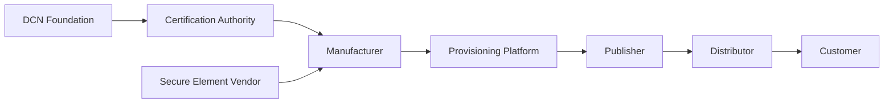
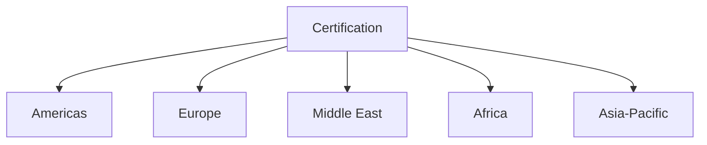

# Phase 4 — Manufacturing

> _Phase 4 establishes the global manufacturing ecosystem for DCN-compliant Physical Digital Assets. This phase transforms validated prototypes into certified commercial products through standardized manufacturing processes, secure provisioning, quality assurance, certification, and worldwide supply chain partnerships._

***

## Objective

With the DCN Standard published and validated through reference implementations, the next step is bringing Physical Digital Assets into large-scale production.

Phase 4 focuses on building the infrastructure required to manufacture millions—and eventually billions—of trusted DCN devices.

The objective is not merely to manufacture NFC cards.

It is to establish a **global manufacturing ecosystem** capable of producing secure Physical Digital Assets that are interoperable, tamper-resistant, and trusted worldwide.

***

## Primary Deliverables

Phase 4 establishes production-ready manufacturing capabilities.

Key deliverables include:

* Certified Manufacturing Partners
* Secure Element Supply Chain
* Secure Provisioning Infrastructure
* Device Personalization Systems
* Quality Assurance Framework
* Certification Laboratories
* Manufacturing APIs
* Global Logistics Framework
* Production Management Platform
* Hardware Traceability System

Together, these components enable trusted industrial-scale production.

***

## Manufacturing Ecosystem



Every manufactured device follows the same trusted production lifecycle.

***

## Certified Manufacturing Partners

The ecosystem encourages participation from certified manufacturers around the world.

Potential manufacturing partners include:

* Smart card manufacturers
* Secure hardware manufacturers
* NFC device manufacturers
* Embedded electronics manufacturers
* Secure printing companies
* Government credential manufacturers
* Identity card manufacturers
* Industrial IoT device manufacturers

Certification ensures every participant follows the same technical and security requirements.

***

## Manufacturing Workflow


Each production stage contributes to the trustworthiness of the final Physical Digital Asset.

***

## Product Portfolio

Manufacturers may produce a diverse range of DCN products.

```
DCN Hardware Portfolio

├── Digital Crypto Notes
├── Smart Cards
├── Metal Cards
├── Premium Payment Cards
├── Identity Cards
├── Transit Cards
├── Gift Cards
├── Wearables
├── NFC Key Fobs
├── NFC Wristbands
├── Smart Tags
├── USB Security Tokens
└── Industrial Authentication Devices
```

Every product implements the same DCN Standard while serving different markets.

***

## Secure Provisioning

Secure provisioning is one of the most critical manufacturing processes.

During provisioning:

* Secure Elements are initialized.
* Cryptographic keys are generated or securely injected.
* Device certificates are installed.
* Manufacturer information is recorded.
* Product identifiers are assigned.
* Publisher profiles are prepared.
* Initial trust relationships are established.

Provisioning ensures every Physical Digital Asset leaves the factory with a verifiable cryptographic identity.

***

## Production Traceability

Every manufactured device should be traceable throughout its lifecycle.

Example production record:

```
Manufacturing Record

Device ID

DCN-000000458921

Manufacturer

Certified Manufacturer

Batch Number

B-2028-0045

Production Date

2028-04-12

Secure Element

Verified

Status

Ready for Publisher Provisioning
```

Traceability supports quality control, warranty management, and incident response.

***

## Quality Assurance

Each device should undergo automated and manual validation.

Testing includes:

* NFC communication
* Secure Element functionality
* Cryptographic operations
* Certificate validation
* Physical inspection
* Durability testing
* Environmental testing
* Performance benchmarking

Only compliant devices proceed to certification.

***

## Global Manufacturing Network

The long-term objective is to establish a distributed manufacturing ecosystem.



Regional manufacturing improves resilience, reduces logistics costs, and supports local market requirements.

***

## Logistics & Distribution

After certification, products move through a secure distribution process.

Distribution channels may include:

* Direct Publisher delivery
* Banking partners
* Government agencies
* Enterprise customers
* Retail distribution
* Online ordering platforms
* Authorized resellers

Chain-of-custody records help preserve trust from factory to end user.

***

## Manufacturing APIs

Manufacturers integrate with the DCN ecosystem using standardized APIs.

Examples include:

```
/manufacturing/orders

/manufacturing/provision

/manufacturing/status

/manufacturing/device

/manufacturing/certificate

/manufacturing/shipment
```

Standard APIs enable automation between manufacturers, Publishers, and logistics providers.

***

## Sustainability

Manufacturing should consider long-term environmental impact.

Potential initiatives include:

* Recyclable materials
* Biodegradable packaging
* Energy-efficient production
* Device recycling programs
* Secure refurbishment
* Circular manufacturing processes
* Carbon footprint reporting

Sustainability strengthens the long-term viability of the ecosystem.

***

## Success Criteria

Phase 4 is considered successful when:

* Certified manufacturing partners are operational.
* Secure provisioning infrastructure is deployed.
* Production quality standards are established.
* Certification laboratories are active.
* Publishers can order compliant devices at scale.
* Global logistics processes are operational.
* Commercial-ready Physical Digital Assets are available.

***

## Example Timeline

```
Phase 4

Manufacturing Partners

↓

Secure Provisioning

↓

Certification

↓

Quality Assurance

↓

Global Distribution

↓

Commercial Production
```

***

## Long-Term Impact

Completing Phase 4 enables:

* Industrial-scale production
* Global hardware availability
* Lower manufacturing costs
* Trusted supply chains
* Faster Publisher onboarding
* Stronger ecosystem confidence
* Commercial readiness

The DCN ecosystem transitions from prototypes to globally available products.

***

## Design Principles

Phase 4 follows five principles.

#### Trusted

Every device is manufactured within a certified supply chain.

#### Secure

Provisioning and production preserve cryptographic integrity.

#### Scalable

Manufacturing supports millions to billions of devices.

#### Traceable

Every product has a verifiable production history.

#### Interoperable

Certified devices operate consistently across the global DCN ecosystem.

***

## Summary

Phase 4 transforms the DCN ecosystem into a production-ready manufacturing network.

Through certified manufacturers, secure provisioning, quality assurance, standardized APIs, and global logistics, the Foundation establishes the industrial infrastructure required to manufacture trusted Physical Digital Assets at worldwide scale while maintaining security, interoperability, and consistent product quality.
