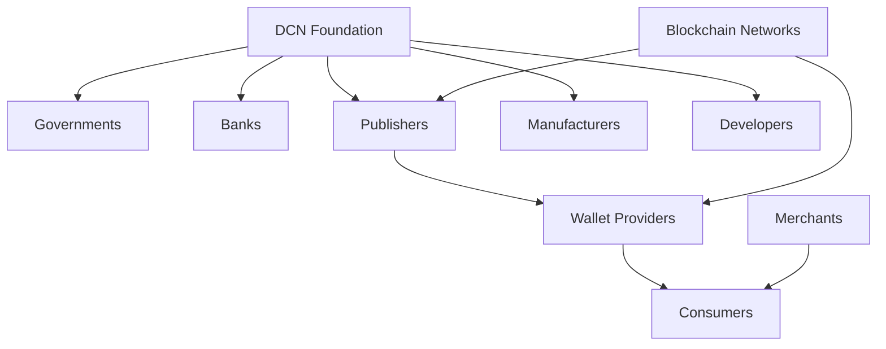

# Phase 5 — Global Adoption

> _Phase 5 represents the long-term vision of the DCN ecosystem—establishing the Digital Crypto Note Standard as the universal infrastructure for Physical Digital Assets. This phase focuses on worldwide adoption across governments, financial institutions, enterprises, merchants, developers, manufacturers, and consumers, creating an interoperable global ecosystem._

***

## Objective

The final phase is not about launching another product.

It is about establishing an **entire industry**.

The vision of the DCN Foundation is that Physical Digital Assets become as common as:

* Credit Cards
* Bank Notes
* Passports
* SIM Cards
* Identity Cards
* Transit Cards

Just as billions of people interact with physical credentials every day, the DCN Standard aims to make secure blockchain-based assets equally familiar.

The success of Phase 5 is measured not by the number of devices manufactured, but by the size and health of the global ecosystem.

***

## Global Vision

The long-term vision is a world where:

* Every person owns Physical Digital Assets.
* Every merchant accepts DCN payments.
* Every wallet understands the DCN Standard.
* Every blockchain supports DCN through standard adapters.
* Every government can issue secure digital credentials.
* Every enterprise can modernize identity and payments using the same infrastructure.

The DCN Standard becomes a universal bridge between physical objects and digital ownership.

***

## Global Ecosystem



Every participant contributes to a decentralized and interoperable ecosystem.

***

## Worldwide Adoption Targets

The ecosystem expands through progressive participation.

```
Global Participants

├── Governments
├── Central Banks
├── Commercial Banks
├── Stablecoin Issuers
├── Enterprises
├── Universities
├── Hospitals
├── Retailers
├── Transport Authorities
├── Payment Providers
├── Developers
├── Manufacturers
├── Publishers
└── Consumers
```

No single organization owns the ecosystem.

Every participant strengthens it.

***

## Industry Adoption

Potential industries include:

#### Financial Services

* Digital Cash
* Stablecoin Notes
* CBDCs
* Cross-border payments

***

#### Government

* National Identity
* Digital Credentials
* Welfare Distribution
* Public Services

***

#### Enterprise

* Payroll
* Corporate Identity
* Access Control
* Expense Management

***

#### Retail

* Gift Cards
* Loyalty Programs
* Memberships
* Consumer Payments

***

#### Transportation

* Transit Cards
* Toll Payments
* Parking
* Smart Mobility

***

#### Education

* Student IDs
* Digital Diplomas
* Campus Payments

***

#### Healthcare

* Patient Identity
* Medical Credentials
* Insurance Cards

***

#### Entertainment

* Event Tickets
* Collectibles
* Fan Membership
* Gaming Assets

***

## Blockchain Expansion

The DCN ecosystem is designed to support many blockchain networks.

```
Supported Networks

├── Bitcoin
├── Ethereum
├── Polygon
├── TON
├── Solana
├── Avalanche
├── BNB Chain
├── Hyperledger
├── CBDC Networks
├── Lycan Chain
└── Future Blockchain Networks
```

New blockchain integrations are achieved through the Blockchain Adapter SDK rather than changing the DCN Standard.

***

## Ecosystem Network Effects

As adoption increases:

* More manufacturers produce devices.
* More Publishers launch products.
* More developers build applications.
* More merchants accept DCN.
* More consumers use Physical Digital Assets.
* More governments adopt open standards.
* More blockchain networks integrate.

Each new participant increases the value of the ecosystem for every other participant.

***

## Innovation Beyond Payments

The DCN Standard evolves beyond financial applications.

Future opportunities include:

* Digital Product Passports
* Carbon Credits
* Machine Identities
* AI Agent Credentials
* Autonomous Vehicle Authentication
* Smart City Infrastructure
* Industrial IoT Security
* Supply Chain Traceability
* Digital Twin Authentication
* Physical Authentication for Robotics

The platform becomes a universal trust layer for the physical world.

***

## Foundation Evolution

As adoption grows, the Foundation focuses on:

* Standard maintenance
* Version evolution
* Security improvements
* Certification expansion
* Community governance
* Global interoperability
* Research initiatives
* Academic collaboration

Its role remains that of a steward rather than a commercial operator.

***

## Global Success Indicators

The long-term success of the ecosystem may be measured through indicators such as:

| Metric                  | Example Objective               |
| ----------------------- | ------------------------------- |
| Certified Manufacturers | Worldwide manufacturing network |
| Certified Wallets       | Broad ecosystem compatibility   |
| Supported Blockchains   | Multi-chain interoperability    |
| Publishers              | Diverse commercial ecosystem    |
| Merchants               | Global acceptance network       |
| Developers              | Active open-source community    |
| Consumers               | Widespread everyday usage       |

The focus is ecosystem growth rather than a single organization's market share.

***

## Future Technologies

The roadmap remains adaptable to future innovation.

Potential integrations include:

* Post-Quantum Cryptography
* Zero-Knowledge Proofs
* Verifiable Credentials
* Decentralized Identity
* AI-assisted security
* Autonomous commerce
* Offline peer-to-peer transactions
* Space-based communications
* Digital twins
* Human-machine identity

Backward compatibility remains a guiding principle.

***

## Design Principles

Phase 5 follows five principles.

#### Global

Designed for worldwide adoption.

#### Open

Participation is available to organizations of all sizes.

#### Interoperable

Every certified implementation works together.

#### Sustainable

The ecosystem grows through independent participants and open governance.

#### Future Ready

The standard evolves alongside emerging technologies while preserving compatibility.

***

## Summary

Phase 5 fulfills the long-term vision of the Digital Crypto Note ecosystem.

By enabling global participation across governments, financial institutions, enterprises, developers, manufacturers, merchants, and blockchain networks, the DCN Standard becomes a universal infrastructure for Physical Digital Assets—bringing secure digital ownership into everyday life through open standards, trusted hardware, and interoperable technology.
