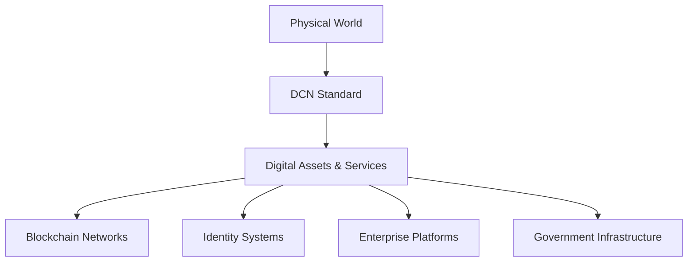
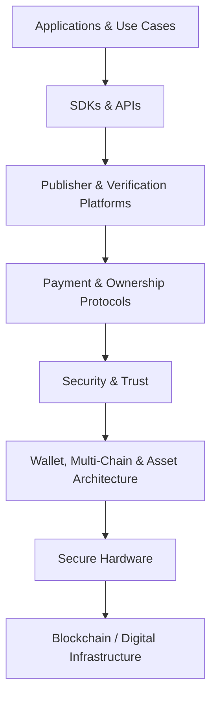
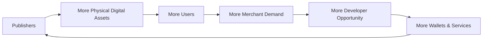

# 22. Conclusion

> _The Conclusion brings together the complete DCN vision: an open global standard for Physical Digital Assets that connects secure hardware, blockchain infrastructure, identity, payments, verification, publishing, and governance into one interoperable framework._

***

## Introduction

The Digital Crypto Note project began with a simple question:

> **Can digital value exist in the physical world with the simplicity of cash and the security of blockchain?**

That question evolved into something much larger.

DCN is no longer only about creating a physical representation of cryptocurrency.

It has evolved into a broader infrastructure concept:

> **DCN — The Open Standard for Physical Digital Assets.**

The objective is to establish a common framework through which organizations can publish, manufacture, verify, transfer, manage, and interact with trusted physical representations of digital assets.

These assets may represent:

* Money
* Identity
* Ownership
* Credentials
* Access
* Benefits
* Tickets
* Loyalty
* Collectibles
* Programmable rights

The same underlying standard can support all of them.

***

## What DCN Represents

DCN introduces a new infrastructure layer between the physical and digital worlds.



The Physical Digital Asset becomes the trusted interface.

The DCN Standard defines how that interface behaves.

***

## From Product to Standard

The most important evolution of the DCN concept is the transition from **product thinking** to **infrastructure thinking**.

DCN is not intended to become:

* One proprietary wallet
* One payment network
* One card manufacturer
* One blockchain
* One stablecoin
* One Publisher

Instead, DCN defines the shared rules that allow all of these participants to work together.

```
DCN Standard

├── Many Publishers
├── Many Manufacturers
├── Many Wallets
├── Many Merchants
├── Many Developers
├── Many Blockchain Networks
└── Many Physical Digital Asset Types
```

The standard becomes more valuable as independent implementations join the ecosystem.

***

## A Common Publishing Framework

At the center of this vision is the **Publisher model**.

Organizations should be able to publish trusted Physical Digital Assets just as developers can publish digital tokens using open blockchain standards.

A Publisher may be:

* A Central Bank
* A Commercial Bank
* A Stablecoin Issuer
* A Government
* A University
* A Retailer
* A Transit Authority
* An Enterprise
* A Gaming Company
* A Creator

Each Publisher creates its own products while following the same DCN rules for:

* Identity
* Issuance
* Security
* Verification
* Ownership
* Lifecycle
* Merchant interaction
* Interoperability

This is what allows DCN to become a publishing infrastructure rather than simply a payment product.

***

## The Complete DCN Stack

The DCN v1.0 architecture defines the major layers required for such an ecosystem.



Each layer is designed to remain replaceable and extensible without compromising the standard as a whole.

***

## What DCN Does Not Attempt to Control

The DCN Standard deliberately avoids controlling areas that should remain open to ecosystem participants.

DCN does not dictate:

* Which blockchain must be used
* Which stablecoin must be issued
* Which manufacturer must produce devices
* Which wallet users must install
* Which cloud provider must host services
* Which commercial model Publishers must adopt

Instead, DCN defines **interoperability boundaries**.

This allows innovation without fragmentation.

***

## Why This Matters

Digital assets today remain largely trapped behind screens.

Physical value remains intuitive, but isolated from programmable digital infrastructure.

DCN creates a bridge between these worlds.

The result could allow:

* A Stablecoin Issuer to publish physical stablecoin notes.
* A Government to publish benefit credentials.
* A University to publish verifiable certificates.
* A Transport Authority to publish transit assets.
* A Brand to publish loyalty assets.
* A Central Bank to offer a physical interface for CBDCs.
* A Creator to publish authenticated collectibles.

All while using the same fundamental architecture.

***

## The Network Effect

A standard becomes powerful when adoption compounds.



Each new participant increases the usefulness of the ecosystem for all others.

This network effect is essential to the long-term DCN vision.

***

## DCN v1.0

DCN v1.0 should be viewed as the **foundation specification**.

It establishes the first common model for:

* Physical Digital Assets
* Secure Hardware
* Wallet Architecture
* Multi-Chain Support
* Security
* Ownership & Trust
* Payment Protocols
* Merchant Acceptance
* Publisher Infrastructure
* Manufacturing
* Verification Services
* Developer SDKs and APIs
* Governance
* Adoption Models

Future versions can deepen these areas without changing the fundamental vision.

***

## The Path Forward

The next stage is not simply to write more documentation.

The standard must progressively move through:

```
Specification

↓

Technical Review

↓

Reference SDKs

↓

Hardware Prototype

↓

Interoperability Testing

↓

Certification

↓

Manufacturing

↓

Publisher Adoption

↓

Merchant Adoption

↓

Global Ecosystem
```

This transition from specification to implementation will determine whether DCN becomes a practical global standard.

***

## Conclusion

The Digital Crypto Note Standard introduces a new way to think about the relationship between physical objects and digital ownership.

The original idea of placing blockchain-backed value into a secure physical note has expanded into something much broader:

> **A universal publishing, verification, ownership, and interaction standard for Physical Digital Assets.**

DCN provides the common infrastructure.

Publishers create the assets.

Manufacturers create the hardware.

Developers build the applications.

Merchants enable acceptance.

Blockchain networks provide settlement.

The Foundation protects interoperability.

Together, these participants can create an ecosystem in which trusted digital value and digital rights can move naturally between the physical and digital worlds.

***

## In this chapter

* [Final Vision](final-vision.md)
* [Open Standard Commitment](open-standard-commitment.md)
* [Call for Collaboration](call-for-collaboration.md)
