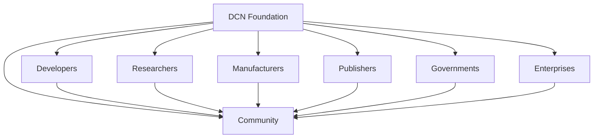

# Call for Collaboration

> _The Digital Crypto Note (DCN) Standard is an open invitation to builders, researchers, governments, enterprises, financial institutions, manufacturers, and innovators worldwide to collaborate in creating the next generation of trusted Physical Digital Assets._

***

## A Shared Vision

The Digital Crypto Note Standard is larger than any single organization.

It is larger than any blockchain.

It is larger than any company, country, or technology platform.

The vision presented throughout this document can only become reality through collaboration.

No global standard has ever been built by one organization alone.

The Internet required thousands of contributors.

The Web required developers across the world.

Open-source software became successful because communities worked together.

The DCN Standard follows the same path.

Its future depends on collective innovation.

***

## An Invitation to the Global Community

We invite organizations and individuals around the world to participate in shaping the future of Physical Digital Assets.

Whether you are building infrastructure, conducting research, creating products, or defining public policy, there is a place for your contribution.

Potential collaborators include:

* Developers
* Hardware manufacturers
* Secure Element vendors
* Wallet providers
* Banks
* Central Banks
* Stablecoin issuers
* Payment processors
* Enterprises
* Governments
* Universities
* Research institutions
* Standards organizations
* Open-source communities
* Blockchain foundations
* Security researchers
* System integrators

Every participant strengthens the ecosystem.

***

## How You Can Contribute

The DCN ecosystem welcomes contributions across many areas.

#### Technical Development

Help improve:

* SDKs
* APIs
* Wallet implementations
* Publisher platforms
* Verification services
* Blockchain adapters
* Security libraries
* Developer tools

***

#### Security Research

Contribute by:

* Reviewing cryptographic protocols
* Auditing implementations
* Performing penetration testing
* Identifying vulnerabilities
* Recommending security improvements

Security improves through continuous peer review.

***

#### Hardware Innovation

Manufacturers and hardware companies can contribute through:

* Secure Element technologies
* NFC innovations
* Durable materials
* New form factors
* Embedded security
* Provisioning solutions
* Sustainable manufacturing

The physical layer is a critical component of the DCN ecosystem.

***

#### Enterprise Adoption

Organizations can explore DCN across multiple business domains.

Potential pilots include:

* Digital identity
* Employee credentials
* Payroll
* Customer loyalty
* Product authentication
* Digital certificates
* Access management
* Corporate payments

Enterprise deployments provide valuable operational feedback.

***

#### Government Collaboration

Governments can participate by evaluating DCN for:

* Digital identity
* Public benefit distribution
* Educational credentials
* Healthcare credentials
* Transportation
* Public sector payments
* CBDC interfaces
* Smart city infrastructure

Public-private collaboration can accelerate secure digital transformation.

***

#### Academic Research

Universities and research institutions can contribute through:

* Cryptographic research
* Human-computer interaction studies
* Secure hardware research
* Privacy technologies
* Digital identity innovation
* Economic analysis
* Regulatory research

Academic collaboration strengthens the scientific foundation of the standard.

***

## Open Innovation Model



The Foundation serves as a steward, while innovation comes from the global community.

***

## Working Groups

As the ecosystem grows, specialized working groups may be established.

Examples include:

```
DCN Working Groups

├── Security
├── Cryptography
├── Hardware
├── Wallets
├── Publisher Platforms
├── Identity
├── Payments
├── Government Adoption
├── Enterprise Integration
├── Manufacturing
├── Certification
└── Developer Experience
```

These groups enable experts to collaboratively evolve specific areas of the standard.

***

## Research Areas

Future collaboration may focus on:

* Post-Quantum Cryptography
* Zero-Knowledge Proofs
* Decentralized Identity (DID)
* Verifiable Credentials (VC)
* Offline Digital Payments
* AI-assisted verification
* Secure manufacturing
* Privacy-preserving authentication
* Cross-chain interoperability
* Machine-to-machine trust

The roadmap remains open to technological evolution.

***

## Our Commitment

The Foundation commits to:

* Maintaining open specifications
* Encouraging transparent governance
* Supporting interoperability
* Promoting independent implementations
* Protecting security
* Publishing technical documentation
* Listening to community feedback
* Evolving the standard responsibly

The ecosystem will be shaped through collaboration rather than centralized control.

***

## Building the Future Together

The next generation of digital infrastructure should be:

* Open
* Secure
* Inclusive
* Interoperable
* Future-ready

The DCN Standard provides the foundation.

The global community builds everything else.

***

## Final Message

Throughout history, standards have transformed industries.

Open networking transformed communication.

Open web standards transformed information.

Open cryptographic protocols transformed digital security.

The Digital Crypto Note Standard seeks to transform the relationship between the physical world and digital ownership.

This journey is only beginning.

Its success will depend not on one company or one technology, but on a worldwide community committed to building a trusted future for Physical Digital Assets.

***

## Join the Movement

Whether you are writing code...

Designing secure hardware...

Building wallets...

Issuing digital assets...

Operating financial infrastructure...

Creating enterprise software...

Developing blockchain networks...

Conducting academic research...

Or shaping public policy...

**You are invited to help build the future of Physical Digital Assets.**

Together, we can establish an open, interoperable, and secure standard that empowers billions of people to interact with digital value as naturally as they interact with the physical world today.

