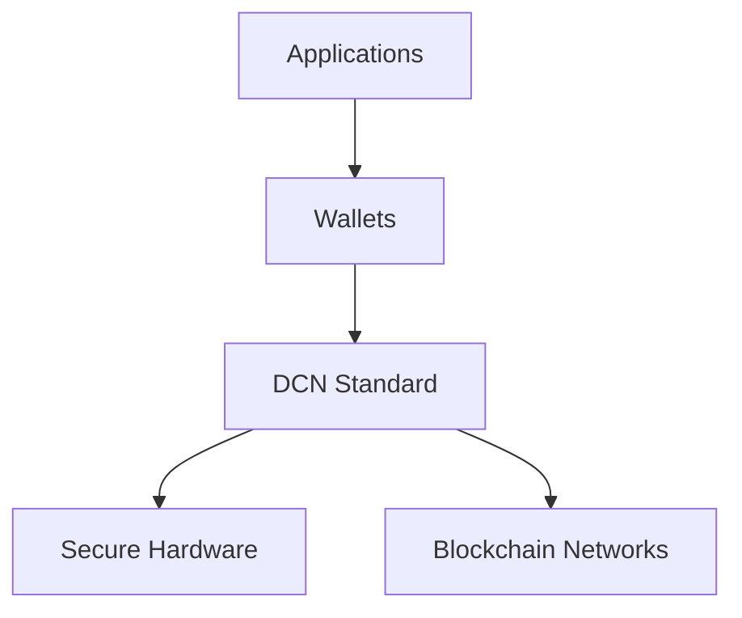

# Final Vision

> _The Digital Crypto Note (DCN) Standard represents a new chapter in the evolution of digital ownership. By bridging trusted physical interfaces with decentralized digital assets, DCN introduces an open, secure, and interoperable foundation for the next generation of payments, identity, credentials, ownership, and programmable value._

***

## Looking Back

Throughout this vision paper, we explored a simple but transformative idea:

> **Digital assets should be as easy to carry, exchange, and trust as physical money.**

Today's blockchain technologies have solved many challenges surrounding digital ownership.

They provide:

* Decentralized trust
* Cryptographic security
* Global settlement
* Transparent verification
* Programmable assets

However, for most people, interacting with these technologies still requires:

* Software wallets
* Seed phrases
* QR codes
* Blockchain knowledge
* Network selection
* Private key management

These requirements create barriers that prevent digital assets from becoming truly universal.

The Digital Crypto Note Standard was conceived to remove these barriers.

***

## A New Layer of Digital Infrastructure

DCN does not seek to replace existing blockchain networks.

Instead, it introduces an entirely new infrastructure layer.



The DCN Standard becomes the trusted bridge connecting the physical world with decentralized digital ownership.

***

## Beyond Cryptocurrency

Although Digital Crypto Notes were inspired by blockchain technology, the DCN Standard extends far beyond cryptocurrency.

The same architecture enables:

* Digital Cash
* Stablecoins
* CBDCs
* Digital Identity
* Certificates
* Transit
* Payroll
* Government Services
* Event Tickets
* Loyalty
* Collectibles
* Enterprise Credentials

One standard supports an unlimited range of trusted Physical Digital Assets.

***

## The Future of Physical Digital Assets

We envision a future where:

Every person owns trusted Physical Digital Assets.

Every merchant accepts interoperable digital payments.

Every government issues secure digital credentials.

Every enterprise modernizes identity and payments using open standards.

Every blockchain participates through standardized adapters.

The physical and digital worlds become seamlessly connected.

***

## A Universal Trust Layer

The long-term ambition of the DCN ecosystem is to become a universal trust layer.

```
Physical World

↓

Physical Digital Assets

↓

DCN Standard

↓

Digital Trust

↓

Global Interoperability
```

Trust no longer depends solely on centralized databases.

It is established through cryptography, secure hardware, standardized verification, and open governance.

***

## Innovation Without Fragmentation

The technology landscape evolves rapidly.

New blockchain networks appear.

New payment systems emerge.

New identity technologies develop.

The DCN Standard is intentionally designed so that innovation occurs **without fragmenting interoperability**.

New technologies integrate through:

* Blockchain Adapters
* SDKs
* APIs
* Certification
* Governance

The core standard remains stable while the ecosystem continues to evolve.

***

## Long-Term Impact

If successfully adopted, the DCN Standard has the potential to influence multiple industries.

```
Future Ecosystem

Payments

Identity

Government

Healthcare

Education

Transportation

Enterprise

Retail

Web3

IoT

AI

Smart Cities
```

The same trusted infrastructure supports all of these domains.

***

## Principles That Guide the Future

The future of the DCN ecosystem is built upon enduring principles.

#### Open

Innovation should be accessible to everyone.

#### Secure

Trust begins with strong cryptography and secure hardware.

#### Interoperable

Independent implementations should work together seamlessly.

#### User-Owned

Individuals should remain in control of their assets and identities.

#### Future Ready

The architecture must evolve without sacrificing compatibility.

***

## Final Message

Every major technological revolution has required a common standard.

The Internet required TCP/IP.

The Web required HTTP.

Mobile payments required NFC.

Digital identity required public key infrastructure.

The next evolution requires a standard for **Physical Digital Assets**.

The Digital Crypto Note Standard aspires to become that foundation.

It is not simply another payment protocol.

It is a framework for trusted digital ownership in the physical world.

***

## Summary

The DCN Standard introduces a new model for interacting with digital assets.

By combining secure hardware, cryptographic trust, blockchain interoperability, open governance, and developer-friendly architecture, it establishes a universal foundation for Physical Digital Assets capable of serving governments, enterprises, developers, financial institutions, and billions of users worldwide.
