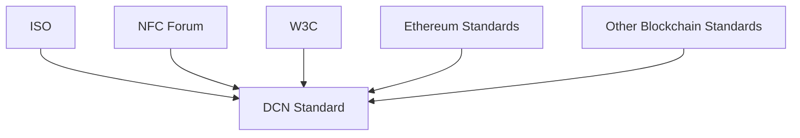

# 24. Standards

> _The Digital Crypto Note (DCN) Standard is designed to complement—not replace—existing international standards. Wherever practical, DCN aligns with globally recognized specifications for smart cards, NFC communication, digital identity, cryptography, payment systems, and blockchain technologies to maximize interoperability and industry adoption._

***

## Introduction

The DCN Standard is built on the principle that open ecosystems should leverage established international standards whenever possible.

Rather than inventing proprietary communication protocols or identity models, DCN adopts and extends proven technologies where appropriate.

This approach provides several advantages:

* Faster adoption
* Greater interoperability
* Lower implementation costs
* Existing hardware compatibility
* Regulatory familiarity
* Long-term sustainability

The following standards are particularly relevant to the DCN ecosystem.

***

## Standards Landscape



The DCN Standard builds upon internationally recognized specifications while defining new capabilities specific to Physical Digital Assets.

***

## ISO Standards

The International Organization for Standardization publishes internationally recognized standards that define many of the technologies used within payment cards, smart cards, cryptography, and identification systems.

Relevant ISO standards include:

| Standard                        | Purpose                                         |
| ------------------------------- | ----------------------------------------------- |
| ISO/IEC 14443                   | Proximity smart cards (contactless NFC cards)   |
| ISO/IEC 7816                    | Integrated circuit smart cards                  |
| ISO/IEC 18092                   | NFC communication protocol                      |
| ISO/IEC 27001                   | Information security management                 |
| ISO/IEC 19790                   | Security requirements for cryptographic modules |
| ISO/IEC 15408 (Common Criteria) | Security evaluation framework                   |
| ISO 20022                       | Financial messaging (where applicable)          |

DCN implementations should align with applicable ISO standards whenever appropriate.

***

## NFC Forum

The NFC Forum defines technical specifications for Near Field Communication technology.

DCN relies on NFC as the primary interaction layer between Physical Digital Assets and compatible devices.

Relevant NFC Forum specifications include:

* NFC Data Exchange Format (NDEF)
* NFC Forum Tag Types
* NFC Digital Protocol
* NFC Analog Specification
* NFC Device Requirements
* NFC Certification Programs

Using established NFC standards ensures compatibility with modern smartphones, readers, and terminals.

***

## W3C DID

The World Wide Web Consortium publishes standards for decentralized identity.

Future versions of the DCN ecosystem may integrate:

* Decentralized Identifiers (DIDs)
* Verifiable Credentials (VCs)
* Credential Presentation
* Selective Disclosure
* Identity Resolution

These standards provide a foundation for interoperable digital identity while allowing users greater control over personal information.

Potential applications include:

* Citizen Identity
* Student Credentials
* Professional Licenses
* Employee Authentication
* Government Services

The DCN Identity Architecture is designed to complement these specifications.

***

## ERC Standards

The Ethereum ecosystem has introduced several token standards that have become widely adopted across blockchain networks.

Relevant standards include:

| Standard | Purpose                                                    |
| -------- | ---------------------------------------------------------- |
| ERC-20   | Fungible digital assets                                    |
| ERC-721  | Non-fungible tokens (NFTs)                                 |
| ERC-1155 | Multi-token assets                                         |
| ERC-4337 | Account Abstraction (Smart Accounts)                       |
| ERC-165  | Interface detection                                        |
| ERC-1271 | Smart contract signature validation                        |
| ERC-6551 | Token-bound accounts (future integration where applicable) |

When Physical Digital Assets represent blockchain assets, the underlying token may follow these standards while the DCN Standard defines the physical interface, ownership lifecycle, authentication, and verification mechanisms.

***

## Relationship with Existing Standards

The DCN Standard complements existing standards rather than competing with them.

```
Existing Standards

↓

Communication

↓

Identity

↓

Blockchain Assets

↓

DCN Standard

↓

Physical Digital Assets
```

Each layer serves a distinct purpose within the technology stack.

***

## Future Standards

As the ecosystem evolves, future versions of DCN may align with additional standards relating to:

* Post-Quantum Cryptography
* Zero-Knowledge Proofs (ZKP)
* Decentralized Identity (DID)
* Verifiable Credentials (VC)
* Secure Elements
* Trusted Execution Environments (TEE)
* Digital Product Passports
* CBDC interoperability
* IoT security
* AI trust frameworks

The Foundation will continuously evaluate emerging standards to improve interoperability without compromising backward compatibility.

***

## Standards Compliance

Organizations implementing the DCN Standard are encouraged to:

* Follow applicable ISO specifications.
* Use certified NFC hardware.
* Implement recognized cryptographic algorithms.
* Align identity systems with W3C recommendations where appropriate.
* Follow blockchain-specific standards for digital assets.
* Complete DCN Certification to ensure interoperability.

Compliance with recognized international standards simplifies integration and strengthens ecosystem trust.

***

## Design Principles

The DCN Standards framework follows five principles.

#### Reuse Existing Standards

Leverage internationally accepted specifications whenever practical.

#### Interoperable

Complement existing technologies instead of replacing them.

#### Vendor Neutral

Remain independent of proprietary implementations.

#### Future Compatible

Adopt emerging standards through an extensible architecture.

#### Globally Recognized

Support technologies already deployed across governments, enterprises, and financial institutions.

***

## Summary

The Digital Crypto Note Standard is built upon internationally recognized technologies rather than proprietary protocols.

By aligning with ISO smart card standards, NFC Forum specifications, W3C decentralized identity standards, and widely adopted blockchain standards such as ERC-20, ERC-721, ERC-1155, and ERC-4337, the DCN ecosystem provides a future-ready, interoperable foundation for Physical Digital Assets.

These standards collectively ensure that DCN remains compatible with global hardware, software, identity systems, payment infrastructure, and blockchain ecosystems while continuing to evolve with future technological advancements.

***

## In this chapter

* [ISO](iso.md)
* [NFC Forum](nfc-forum.md)
* [W3C DID](w3c-did.md)
* [ERC Standards](erc-standards.md)
