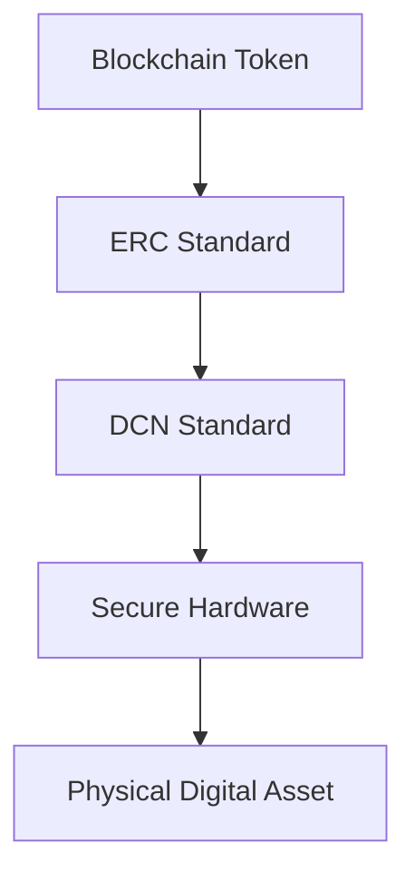

# ERC Standards

> _The Digital Crypto Note (DCN) Standard is blockchain-neutral; however, many Physical Digital Assets will represent tokens deployed on Ethereum Virtual Machine (EVM) compatible networks. To maximize interoperability, the DCN ecosystem aligns with widely adopted Ethereum Request for Comment (ERC) standards while extending them into the physical world through secure hardware, standardized ownership, authentication, and verification._

***

## Introduction

Blockchain standards define how digital assets behave.

Without common token standards:

* Wallets cannot recognize assets.
* Exchanges cannot support interoperability.
* Applications require custom integrations.
* Developers must build proprietary solutions.

The Ethereum ecosystem introduced standardized token interfaces through the **ERC (Ethereum Request for Comment)** process.

These standards have become the foundation for thousands of blockchain applications and have also been adopted by numerous EVM-compatible networks.

The DCN Standard does **not replace** ERC standards.

Instead, it extends them by providing a trusted physical interface for blockchain-native assets.

***

## Relationship Between ERC and DCN



ERC standards define the **digital asset**.

The DCN Standard defines how that asset is securely represented and interacted with in the physical world.

***

## Why ERC Standards Matter

ERC standards provide:

* Standardized token interfaces
* Wallet compatibility
* Smart contract interoperability
* Marketplace integration
* Exchange compatibility
* Developer familiarity
* Multi-chain portability across EVM ecosystems

This allows DCN Publishers to issue Physical Digital Assets backed by existing blockchain tokens without inventing proprietary asset models.

***

## ERC-20

### Fungible Tokens

ERC-20 is the most widely adopted token standard for interchangeable digital assets.

Typical ERC-20 assets include:

* Stablecoins
* Utility Tokens
* Governance Tokens
* Payment Tokens
* CBDC pilots
* Loyalty Tokens

Within the DCN ecosystem, ERC-20 tokens may power:

* Digital Cash
* Stablecoin Notes
* Payroll Cards
* Government Benefits
* Merchant Payments
* Reloadable Assets

Example:

```
USDC Token

↓

Wallet Balance

↓

DCN Publisher

↓

Digital Crypto Note

↓

Tap-to-Pay
```

The blockchain maintains token ownership while the DCN ecosystem provides the secure physical interface.

***

## ERC-721

### Non-Fungible Tokens (NFTs)

ERC-721 defines unique blockchain assets.

Each token has its own identity and ownership.

Examples include:

* Digital Art
* Luxury Certificates
* Collectibles
* Event Tickets
* Property Records
* Membership Assets

Within the DCN ecosystem, ERC-721 is particularly suitable for:

* DCN-C Collectibles
* Identity Credentials
* Event Tickets
* Ownership Certificates
* Luxury Authentication

The Secure Element links the physical object with the unique blockchain asset.

***

## ERC-1155

### Multi-Token Standard

ERC-1155 supports multiple asset types within a single smart contract.

It combines features of both fungible and non-fungible assets.

Possible DCN applications include:

* Gaming Assets
* Event Ticket Collections
* Loyalty Rewards
* Membership Programs
* Digital Coupons
* Mixed Asset Collections

This standard reduces deployment complexity for publishers managing many asset types.

***

## ERC-4337

### Account Abstraction

Account Abstraction introduces programmable smart accounts.

Unlike traditional externally owned accounts (EOAs), smart accounts support advanced features such as:

* Session keys
* Spending limits
* Multi-signature authorization
* Social recovery
* Gas sponsorship
* Programmable permissions

For the DCN ecosystem, ERC-4337 enables capabilities such as:

* Spending limits on Digital Crypto Notes
* Merchant-specific authorization
* Family-controlled recovery
* Time-based spending rules
* Corporate approval workflows
* Gasless user experiences

Smart Accounts complement the programmable capabilities of **DCN-P**.

***

## ERC-1271

### Smart Contract Signatures

ERC-1271 defines a standard for verifying signatures produced by smart contract wallets.

Potential DCN applications include:

* Enterprise wallet authentication
* DAO-controlled assets
* Multi-signature ownership
* Institutional custody
* Corporate approvals

This enables verification workflows beyond traditional private-key signatures.

***

## ERC-165

### Interface Detection

ERC-165 enables smart contracts to advertise supported interfaces.

Within the DCN ecosystem, this assists:

* Wallet compatibility
* Publisher interoperability
* Marketplace integrations
* Verification services
* Automated application support

Applications can dynamically discover supported asset capabilities.

***

## ERC-6551

### Token Bound Accounts

ERC-6551 allows NFTs to own blockchain accounts.

Future DCN implementations may leverage Token Bound Accounts to enable:

* Self-owned collectibles
* Intelligent identity credentials
* Digital product passports
* Dynamic asset inventories
* Programmable ownership logic

This is particularly relevant for advanced collectible and identity use cases.

***

## ERC Standards Mapping

```
ERC Standard                DCN Use Case

ERC-20                      Digital Cash, Stablecoin Notes

ERC-721                     Collectibles, Certificates, Identity

ERC-1155                    Gaming, Tickets, Loyalty

ERC-4337                    Smart Wallets, Programmable Assets

ERC-1271                    Enterprise Authentication

ERC-165                     Interface Discovery

ERC-6551                    Intelligent Collectibles
```

This mapping illustrates how blockchain token standards complement the DCN ecosystem.

***

## Multi-Chain Compatibility

Although ERC standards originated on Ethereum, they are widely supported across EVM-compatible networks.

Examples include:

* Ethereum
* Polygon
* BNB Chain
* Avalanche C-Chain
* Arbitrum
* Optimism
* Base
* Scroll
* Linea
* Lycan Chain
* Future EVM-compatible networks

The DCN Blockchain Adapter SDK abstracts network-specific implementation details while preserving consistent behavior for applications.

***

## DCN Extensions Beyond ERC

ERC standards define blockchain behavior.

The DCN Standard introduces additional capabilities beyond the blockchain layer.

These include:

* Secure Element integration
* Physical asset lifecycle
* Device certificates
* Publisher certificates
* Ownership transfer protocols
* Secure NFC communication
* Anti-counterfeit protection
* Manufacturing identity
* Physical authentication
* Recovery workflows

Together, ERC and DCN create a complete physical-digital asset ecosystem.

***

## Future Ethereum Standards

The Ethereum ecosystem continues to evolve.

Future DCN versions may evaluate support for additional ERC standards as they mature, provided they:

* Improve interoperability
* Enhance security
* Increase developer productivity
* Preserve backward compatibility
* Align with the DCN architecture

***

## Design Principles

The DCN Foundation follows five principles regarding ERC integration.

#### Compatible

Support widely adopted blockchain standards.

#### Blockchain Neutral

ERC support does not exclude other blockchain ecosystems.

#### Extensible

New token standards can be integrated through Blockchain Adapters.

#### Secure

Physical interactions remain protected by the DCN Security Architecture.

#### Interoperable

Publishers and Wallets can support blockchain assets using standardized interfaces.

***

## Summary

ERC standards provide the foundation for representing blockchain-native assets, while the DCN Standard extends those assets into the physical world.

By combining ERC-20, ERC-721, ERC-1155, ERC-4337, ERC-1271, ERC-165, and future Ethereum standards with secure hardware, cryptographic authentication, standardized ownership, and interoperable verification, the DCN ecosystem enables trusted Physical Digital Assets that seamlessly bridge decentralized blockchain infrastructure with everyday physical interactions.
