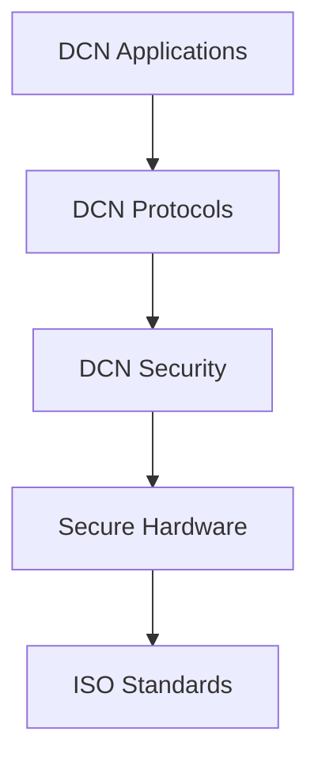

# ISO

> _The Digital Crypto Note (DCN) Standard builds upon internationally recognized ISO standards for smart cards, contactless communication, cryptographic security, information security, and financial messaging. Rather than replacing these standards, DCN extends them to enable secure, interoperable Physical Digital Assets._

***

## Introduction

The **International Organization for Standardization (ISO)** develops globally accepted standards that enable interoperability across industries.

Today, billions of devices rely on ISO standards, including:

* Payment Cards
* Passports
* National Identity Cards
* SIM Cards
* Banking Systems
* NFC Smart Cards
* Security Hardware
* Cryptographic Devices

The DCN Standard leverages these proven technologies instead of introducing proprietary replacements.

By aligning with ISO specifications, DCN ensures that Physical Digital Assets can operate on existing infrastructure while benefiting from decades of engineering, security research, and industry adoption.

***

## Why ISO Matters

The mission of DCN is to become a **global open standard**.

Achieving this requires compatibility with internationally recognized technologies.

Using ISO standards provides:

* Proven interoperability
* Established security practices
* Global hardware compatibility
* Regulatory familiarity
* Manufacturing consistency
* Lower implementation costs
* Faster adoption

Organizations implementing DCN can build upon technologies already deployed worldwide.

***

## ISO Standards within the DCN Stack



ISO standards provide the foundation upon which the DCN architecture is built.

***

## ISO/IEC 14443 — Contactless Smart Cards

The most important ISO standard for DCN is **ISO/IEC 14443**.

This standard defines:

* Contactless proximity cards
* NFC communication
* Card activation
* Anti-collision procedures
* Communication protocol
* Data exchange

Almost every modern payment card and contactless identity card uses ISO/IEC 14443.

DCN Physical Digital Assets are expected to support this standard for maximum compatibility with smartphones, payment terminals, and NFC readers.

***

## ISO/IEC 7816 — Smart Card Architecture

ISO/IEC 7816 defines the architecture of integrated circuit smart cards.

Relevant areas include:

* File systems
* APDU (Application Protocol Data Unit) commands
* Secure communication
* Card operating systems
* Command structures

Although DCN primarily uses contactless communication, ISO/IEC 7816 remains highly relevant because many Secure Elements implement these command structures internally.

***

## ISO/IEC 18092 — Near Field Communication

ISO/IEC 18092 defines the NFC communication protocol.

Key capabilities include:

* Device discovery
* Peer-to-peer communication
* NFC operating modes
* Communication timing
* Data exchange

This standard allows DCN assets to communicate reliably with:

* Smartphones
* Payment terminals
* Identity readers
* Enterprise access systems
* Dedicated verification devices

***

## ISO/IEC 27001 — Information Security

The DCN Foundation encourages organizations operating critical infrastructure to align with **ISO/IEC 27001**.

This standard defines best practices for:

* Information Security Management Systems (ISMS)
* Risk assessment
* Access control
* Security governance
* Incident management
* Business continuity

Publisher Platforms, Verification Services, and Certification Authorities should adopt strong operational security practices based on recognized frameworks.

***

## ISO/IEC 19790 — Cryptographic Modules

Cryptographic hardware used within the DCN ecosystem should follow recognized security requirements.

ISO/IEC 19790 defines:

* Cryptographic module security
* Physical protection
* Key management
* Random number generation
* Secure execution
* Self-testing requirements

These principles support secure implementations of Secure Elements and Hardware Security Modules (HSMs).

***

## ISO/IEC 15408 — Common Criteria

The **Common Criteria** framework provides internationally recognized methods for evaluating IT security products.

Potential certification targets include:

* Secure Elements
* Hardware Wallets
* Identity Devices
* Authentication Modules
* Security Firmware

Manufacturers may use Common Criteria evaluations to demonstrate the security of DCN-compliant products.

***

## ISO 20022 — Financial Messaging

For enterprise and banking integrations, DCN implementations may align with **ISO 20022**.

This standard provides a common language for financial messaging used by:

* Commercial banks
* Central banks
* Payment networks
* Clearing systems
* Financial institutions

Although blockchain transactions may use different protocols, ISO 20022 can simplify interoperability with traditional financial infrastructure.

***

## ISO Standards Mapping

```
DCN Component                        Relevant ISO Standard

Secure NFC Communication             ISO/IEC 14443

Smart Card Commands                  ISO/IEC 7816

NFC Communication                    ISO/IEC 18092

Information Security                 ISO/IEC 27001

Cryptographic Hardware               ISO/IEC 19790

Security Certification               ISO/IEC 15408

Financial Messaging                  ISO 20022
```

This mapping illustrates how DCN leverages existing standards across different architectural layers.

***

## Benefits for the DCN Ecosystem

Alignment with ISO standards provides significant advantages.

#### Manufacturers

Can leverage existing production processes and certification pathways.

***

#### Wallet Providers

Can interact with devices using standardized communication protocols.

***

#### Governments

Can integrate with existing identity and payment infrastructures.

***

#### Banks

Can connect DCN services with traditional financial messaging systems.

***

#### Developers

Can build on mature and well-documented technologies rather than proprietary interfaces.

***

#### Enterprises

Can deploy interoperable solutions using globally recognized standards.

***

## Design Principles

The DCN Foundation follows five principles when adopting ISO standards.

#### Reuse

Leverage proven international specifications.

#### Compatibility

Remain interoperable with existing infrastructure.

#### Security

Build upon internationally accepted security practices.

#### Scalability

Support deployment across billions of devices.

#### Longevity

Ensure long-term compatibility through stable global standards.

***

## Future Alignment

As ISO publishes new standards relevant to digital identity, secure hardware, post-quantum cryptography, digital payments, and trusted computing, the DCN Foundation will evaluate their applicability.

Where beneficial, future versions of the DCN Standard may incorporate these technologies while preserving backward compatibility and interoperability.

***

## Summary

ISO standards provide the technological foundation upon which the Digital Crypto Note ecosystem is built.

By aligning with internationally recognized specifications for contactless smart cards, NFC communication, secure hardware, information security, cryptographic modules, security evaluation, and financial messaging, the DCN Standard ensures that Physical Digital Assets are interoperable, secure, and compatible with global infrastructure.

This commitment allows organizations worldwide to adopt DCN using proven technologies while benefiting from an open, future-ready standard for Physical Digital Assets.
