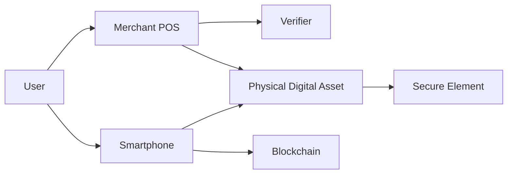
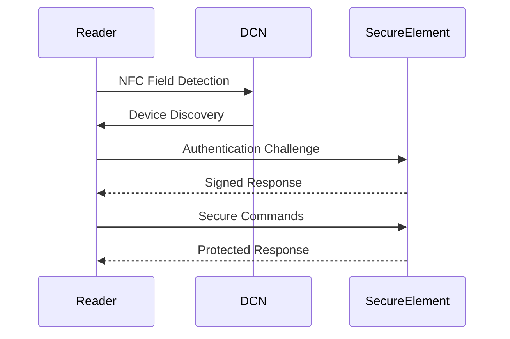

# NFC Forum

> _The Digital Crypto Note (DCN) Standard adopts NFC Forum specifications as the primary communication layer between Physical Digital Assets and compatible devices. By leveraging globally recognized NFC standards, DCN ensures interoperability with billions of smartphones, payment terminals, access control systems, and NFC-enabled readers._

***

## Introduction

Near Field Communication (NFC) has become one of the world's most widely deployed short-range communication technologies.

Today, NFC powers:

* Contactless Payments
* Mobile Wallets
* Smart Cards
* Digital Identity
* Transit Systems
* Building Access
* Device Pairing
* Product Authentication
* Healthcare Systems

Billions of smartphones already include NFC hardware.

Rather than introducing a proprietary communication technology, the DCN Standard builds upon the mature ecosystem established by the NFC Forum.

***

## Why NFC Forum Matters

The NFC Forum develops open technical specifications that ensure interoperability between:

* Smartphones
* Payment Terminals
* Smart Cards
* NFC Readers
* IoT Devices
* Secure Hardware
* Consumer Electronics

Using NFC Forum specifications allows DCN Physical Digital Assets to operate with existing infrastructure while maintaining compatibility across manufacturers.

***

## NFC within the DCN Architecture



The NFC interface provides the communication channel, while the Secure Element performs trusted cryptographic operations.

***

## NFC Communication Model

Every DCN interaction follows a common sequence.



The NFC interface transports commands, while authentication and authorization are enforced by the Secure Element.

***

## Relevant NFC Forum Specifications

The DCN ecosystem primarily aligns with the following NFC Forum specifications.

| Specification                   | Purpose                                                                    |
| ------------------------------- | -------------------------------------------------------------------------- |
| NFC Digital Protocol            | Defines NFC communication between devices                                  |
| NFC Analog Specification        | RF characteristics and radio performance                                   |
| NFC Activity Specification      | Device discovery and activation                                            |
| NFC Data Exchange Format (NDEF) | Standardized message format                                                |
| Tag Type Specifications         | Standardized NFC tag behavior                                              |
| Connection Handover             | Secure transition to Bluetooth, Wi-Fi or other transports where applicable |

These specifications provide a consistent communication layer across compliant devices.

***

## NFC Data Exchange Format (NDEF)

The NFC Forum NDEF specification provides a standard structure for exchanging data.

Within the DCN ecosystem, NDEF may be used for:

* Initial device discovery
* Publisher identification
* Wallet deep linking
* Capability advertisement
* Public metadata exchange
* Application launch

Sensitive information is **not** stored in plain NDEF records.

Instead, authenticated sessions are established before protected data is exchanged.

***

## Secure Communication

After device discovery, DCN transitions into a secure communication session.

```
NFC Detection

↓

Device Identification

↓

Mutual Authentication

↓

Secure Messaging

↓

Business Operation

↓

Session Complete
```

This minimizes exposure of sensitive information while maintaining a fast user experience.

***

## NFC Operating Modes

The DCN Standard supports multiple NFC operating models depending on the use case.

#### Card Emulation

A Physical Digital Asset behaves like a secure contactless smart card.

Typical uses:

* Payments
* Transit
* Identity
* Access Control

***

#### Reader Mode

Wallet applications, merchant terminals, and verification devices operate as NFC readers.

Typical uses:

* Asset verification
* Ownership transfer
* Device provisioning
* Merchant acceptance

***

#### Peer-to-Peer

Where supported, compatible devices may establish secure peer-to-peer communication for functions such as:

* Device pairing
* Asset exchange
* Offline synchronization
* Secure provisioning workflows

***

## Device Compatibility

The use of NFC Forum standards enables compatibility with:

```
Compatible Devices

├── Android Phones
├── iPhone (Supported NFC APIs)
├── Merchant POS Terminals
├── Smart Card Readers
├── Enterprise Access Readers
├── Transit Validators
├── Kiosks
├── Industrial NFC Readers
└── Dedicated Verification Devices
```

The DCN Standard does not require proprietary reader hardware.

***

## Performance Considerations

NFC interactions should be optimized for everyday use.

Typical objectives include:

* Fast device detection
* Low-latency authentication
* Minimal user interaction
* Reliable communication
* Low power consumption
* Consistent operation across certified devices

Actual performance depends on hardware capabilities, Secure Element implementation, and deployment environment.

***

## Security Considerations

While NFC provides the transport layer, security is provided by the DCN architecture.

Security mechanisms include:

* Mutual Authentication
* Secure Messaging
* Device Certificates
* Publisher Certificates
* Secure Element Isolation
* Cryptographic Challenge-Response
* Anti-Replay Protection
* Session Key Negotiation

Sensitive operations should never rely solely on NFC communication without cryptographic verification.

***

## NFC in Different DCN Products

```
DCN Product                  NFC Usage

Digital Crypto Note          Payments

Identity Card                Authentication

Transit Card                 Entry Validation

Gift Card                    Balance & Redemption

Collectible                  Authenticity Verification

Certificate                  Credential Validation

Payroll Card                 Salary Access

Government Benefit Card      Benefit Redemption
```

The same NFC communication model supports a wide variety of Physical Digital Assets.

***

## Future NFC Evolution

As NFC technology evolves, future versions of the DCN Standard may support:

* Extended NFC data rates
* Longer secure sessions
* Improved mobile operating system APIs
* Secure multi-device interactions
* Enhanced IoT integration
* Smart wearable authentication
* Offline peer-to-peer asset exchange

These enhancements can be adopted while maintaining backward compatibility where practical.

***

## Design Principles

The DCN Foundation follows five principles regarding NFC integration.

#### Standards-Based

Build upon NFC Forum specifications.

#### Interoperable

Operate across certified NFC devices.

#### Secure

Protect every interaction with cryptographic authentication.

#### Efficient

Optimize for fast, intuitive tap interactions.

#### Future Ready

Support new NFC capabilities without changing the core DCN architecture.

***

## Summary

The NFC Forum specifications provide the communication foundation of the Digital Crypto Note ecosystem.

By leveraging globally adopted NFC standards while combining them with Secure Elements, cryptographic authentication, certificate infrastructure, and secure messaging, the DCN Standard delivers a familiar **tap-to-interact** experience that is interoperable, secure, and scalable across payments, identity, credentials, transportation, government services, and every category of Physical Digital Asset.
