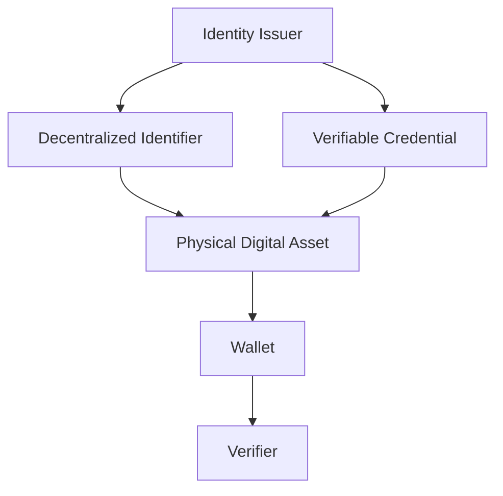
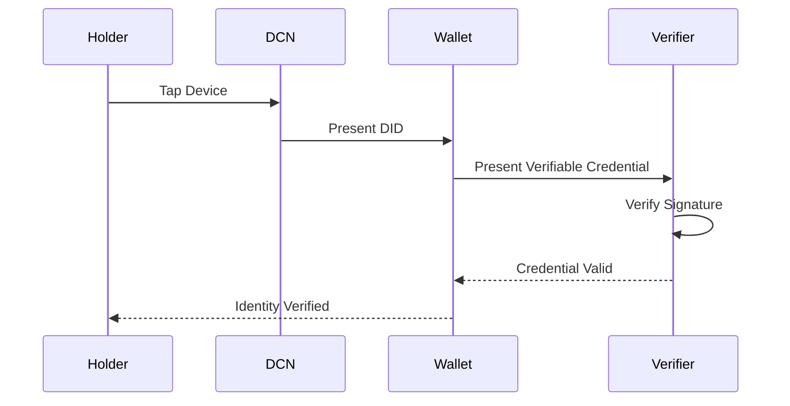

# W3C DID

> _The Digital Crypto Note (DCN) Standard is designed to align with the World Wide Web Consortium (W3C) Decentralized Identity ecosystem. By supporting Decentralized Identifiers (DIDs) and Verifiable Credentials (VCs), DCN enables secure, privacy-preserving, and interoperable identity for Physical Digital Assets._

***

## Introduction

Identity is becoming one of the most important components of digital infrastructure.

People increasingly need to prove:

* Who they are
* What they own
* What they are authorized to access
* Which organization issued their credentials
* Whether a credential is still valid

Traditional identity systems rely on centralized databases controlled by individual organizations.

This creates several challenges:

* Duplicate identities
* Vendor lock-in
* Privacy concerns
* Limited interoperability
* Difficult cross-border verification
* Central points of failure

The **World Wide Web Consortium (W3C)** introduced Decentralized Identifiers (DIDs) and Verifiable Credentials (VCs) to address these issues.

The DCN Standard is designed to integrate with these technologies while extending them into the physical world.

***

## Why W3C Matters

The W3C develops global standards for the Web.

Its identity standards are intended to provide:

* Interoperable digital identity
* User-controlled credentials
* Privacy-preserving verification
* Vendor neutrality
* Cross-platform compatibility

Rather than creating a proprietary identity model, DCN aligns with these open standards wherever appropriate.

***

## Identity within the DCN Architecture



The DID provides a persistent decentralized identifier, while Verifiable Credentials represent trusted claims associated with the Physical Digital Asset.

***

## Decentralized Identifiers (DIDs)

A DID is a globally unique identifier that is not dependent on a centralized authority.

Unlike traditional identifiers:

* No central registry is required.
* Multiple identity providers can coexist.
* Users retain greater control.
* Identifiers are cryptographically verifiable.

Example:

```
did:dcn:8f94d6ab45...

or

did:example:123456789abcdef
```

The DCN Standard does not mandate a specific DID method.

Publishers may support any compatible DID method appropriate for their deployment.

***

## Verifiable Credentials (VCs)

A Verifiable Credential is a digitally signed credential issued by a trusted organization.

Examples include:

* Government ID
* University Degree
* Medical License
* Employee Badge
* Professional Certificate
* Transit Pass
* Membership Card

Each credential contains:

* Issuer
* Subject
* Claims
* Digital Signature
* Expiration (if applicable)
* Proof of Authenticity

Within the DCN ecosystem, these credentials may be securely associated with a Physical Digital Asset.

***

## Identity Verification Flow



The verification process validates cryptographic proofs rather than relying solely on centralized databases.

***

## Selective Disclosure

Privacy is a key objective of W3C identity standards.

Rather than revealing an entire identity, users may disclose only the information required.

Examples include:

* Prove age over 18 without revealing birth date.
* Prove university enrollment without revealing academic history.
* Prove employment without revealing salary.
* Prove residency without revealing home address.

Future DCN implementations may combine Verifiable Credentials with Zero-Knowledge Proofs (ZKPs) to enable even stronger privacy guarantees.

***

## DCN Identity Use Cases

The DCN ecosystem may support W3C identity standards across many applications.

```
Identity Applications

├── National Identity
├── Passport Companion
├── Driver License
├── Employee Badge
├── Student ID
├── Medical Credential
├── Professional License
├── Banking KYC
├── DAO Membership
└── Digital Citizen Identity
```

Each credential can be cryptographically verified while remaining under the holder's control.

***

## Relationship Between DID and DCN

The two standards have complementary roles.

```
W3C DID

↓

Digital Identity

↓

DCN Standard

↓

Physical Identity Device

↓

Secure NFC Interaction
```

The W3C defines the digital identity model.

The DCN Standard defines the trusted physical interface, secure hardware, authentication, lifecycle management, and user interaction.

***

## DCN Extensions Beyond W3C

The W3C standards focus primarily on digital identity.

The DCN Standard extends these capabilities into physical infrastructure by adding:

* Secure Element integration
* Hardware Root of Trust
* Device Certificates
* Publisher Certificates
* Mutual Authentication
* Secure NFC communication
* Anti-counterfeit protection
* Physical ownership lifecycle
* Secure manufacturing and provisioning

These additions enable identity credentials to exist securely in physical form.

***

## Future Identity Standards

The DCN Foundation will continue monitoring developments within the W3C ecosystem, including:

* DID Core
* Verifiable Credentials Data Model
* DID Resolution
* DID Authentication
* Credential Status
* Selective Disclosure
* Privacy-preserving credential exchange

Future DCN versions may incorporate new W3C recommendations while maintaining backward compatibility.

***

## Design Principles

The DCN Foundation follows five principles regarding W3C identity integration.

#### Open

Support internationally recognized identity standards.

#### Privacy Preserving

Enable minimal disclosure of personal information.

#### Interoperable

Work across compliant wallets, issuers, and verification services.

#### User Controlled

Allow individuals to manage and present their credentials.

#### Extensible

Support future identity innovations without redesigning the core architecture.

***

## Summary

The W3C DID and Verifiable Credential standards provide the identity foundation for the Digital Crypto Note ecosystem.

By combining decentralized identifiers, cryptographically verifiable credentials, Secure Elements, NFC communication, certificate infrastructure, and standardized ownership models, the DCN Standard enables trusted Physical Digital Identity that is interoperable, privacy-preserving, and suitable for governments, enterprises, financial institutions, educational organizations, and Web3 ecosystems.
