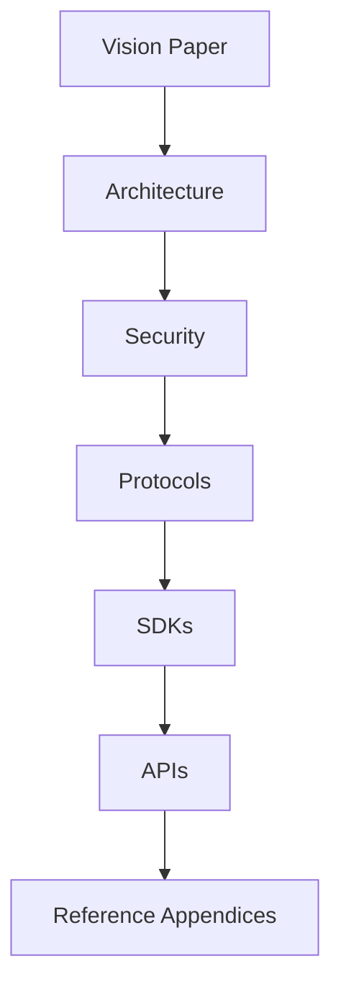

# 25. Appendices

> _The appendices provide supporting technical material that complements the Digital Crypto Note (DCN) Standard. While the main chapters describe the architecture, principles, and ecosystem, the appendices offer practical reference material for implementers, developers, manufacturers, auditors, and researchers._

***

## Introduction

The DCN Standard consists of multiple layers, including:

* Secure Hardware
* Wallet Architecture
* Publisher Infrastructure
* Payment Protocols
* Certificate Infrastructure
* Manufacturing
* Verification Services
* SDKs
* APIs

The appendices consolidate technical examples and implementation guidance without introducing new normative requirements.

They are intended to help ecosystem participants better understand how the DCN architecture operates in practice.

***

## Contents

The appendices include the following reference sections:

1. Architecture Diagrams
2. Protocol Flow
3. API Examples
4. Frequently Asked Questions (FAQ)

Each appendix is informative and may be expanded in future versions of the specification.

***

## Intended Audience

These appendices are useful for:

* Solution Architects
* Software Developers
* Hardware Manufacturers
* Publisher Platforms
* Wallet Developers
* Merchant Integrators
* Security Auditors
* Government Agencies
* Enterprise Architects
* Researchers

Different readers may reference different appendices depending on their role.

***

## Reference Architecture

The appendices build upon the technical foundation established throughout the Vision Paper.

***

## Informative vs. Normative

The DCN documentation distinguishes between two categories of content.

#### Normative

Normative content defines mandatory behavior for compliant implementations.

Examples include:

* Protocol specifications
* Security requirements
* Certificate validation
* Message formats
* Compliance rules

***

#### Informative

Informative content provides guidance and examples.

Examples include:

* Architecture diagrams
* Example workflows
* Sample APIs
* Integration examples
* Frequently asked questions

The appendices are primarily informative unless explicitly stated otherwise.

***

## Evolution

As the DCN ecosystem evolves, future versions of the appendices may include:

* Additional protocol examples
* SDK samples
* Manufacturing procedures
* Certification examples
* Security test vectors
* Performance benchmarks
* Deployment recommendations
* Regulatory implementation guides

The appendices are expected to grow alongside the standard while remaining compatible with previous releases.

***

## Design Principles

The appendices follow five principles.

#### Practical

Focus on implementation guidance.

#### Clear

Present technical concepts using diagrams and examples.

#### Reusable

Provide material that developers and architects can reference directly.

#### Consistent

Align with the core DCN Standard.

#### Extensible

Allow future additions without changing the core specification.

***

## Summary

The appendices serve as the practical companion to the DCN Standard.

They provide reference material, implementation guidance, technical examples, and explanatory resources that support developers, manufacturers, publishers, enterprises, governments, and researchers as they implement interoperable Physical Digital Assets.

***

#### Next

**Appendix → Architecture Diagrams**

## In this chapter

* [Architecture Diagrams](architecture-diagrams.md)
* [Protocol Flow](protocol-flow.md)
* [API Examples](api-examples.md)
* [FAQ](faq.md)
