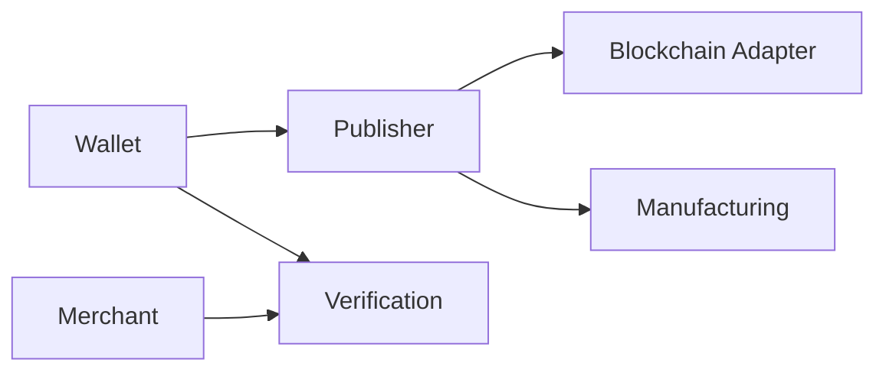

# API Examples

> _This appendix provides illustrative REST API examples for implementing the Digital Crypto Note (DCN) ecosystem. These examples demonstrate common interactions between Wallets, Publisher Platforms, Merchant Systems, Verification Services, Manufacturing Systems, and Blockchain Adapters. They are intended as reference examples and do not define the normative API specification._

***

## Introduction

The DCN ecosystem is API-driven.

Every major component communicates through standardized interfaces.

Examples include:

* Wallet ↔ Publisher
* Wallet ↔ Verification Service
* Merchant ↔ Verification Service
* Publisher ↔ Manufacturing
* Publisher ↔ Blockchain Adapter
* Developer SDK ↔ APIs

Actual implementations may use REST, GraphQL, gRPC, WebSocket, or future protocols, but the logical operations remain consistent.

***

## API Architecture



Each service exposes standardized APIs that enable interoperability across independent implementations.

***

## API Design Principles

The DCN API framework follows these principles:

* RESTful resource design
* JSON request and response payloads
* Versioned endpoints
* OAuth 2.0 / OpenID Connect compatible authentication
* Mutual TLS (mTLS) for service-to-service communication
* Idempotent operations where appropriate
* Cryptographic request signing for sensitive operations
* Consistent error handling

***

## Wallet APIs

### Register Physical Digital Asset

```http
POST /api/v1/wallet/assets/register
```

Request

```json
{
  "deviceId": "DCN-9A3F5E12",
  "publisherId": "publisher-001",
  "walletAddress": "0xA84F...91D2"
}
```

Response

```json
{
  "status": "registered",
  "assetId": "asset-10291",
  "owner": "0xA84F...91D2"
}
```

***

### Get Asset Balance

```http
GET /api/v1/wallet/assets/{assetId}/balance
```

Response

```json
{
  "assetId": "asset-10291",
  "balance": "250.00",
  "currency": "USDC"
}
```

***

### Initiate Ownership Transfer

```http
POST /api/v1/wallet/assets/{assetId}/transfer
```

Request

```json
{
  "newOwner": "0xD41C...82AB"
}
```

Response

```json
{
  "status": "pending",
  "transferId": "TX-889201"
}
```

***

## Publisher APIs

### Issue New Physical Digital Asset

```http
POST /api/v1/publisher/assets
```

Request

```json
{
  "assetProfile": "DCN-R",
  "token": "USDC",
  "amount": 1000,
  "deviceId": "DCN-9A3F5E12"
}
```

Response

```json
{
  "assetId": "asset-10291",
  "status": "issued"
}
```

***

### Suspend Asset

```http
POST /api/v1/publisher/assets/{assetId}/suspend
```

Response

```json
{
  "status": "suspended"
}
```

***

### Recover Asset

```http
POST /api/v1/publisher/assets/{assetId}/recover
```

Response

```json
{
  "replacementAsset": "asset-20581",
  "status": "completed"
}
```

***

## Verification APIs

### Verify Device Authenticity

```http
POST /api/v1/verification/device
```

Request

```json
{
  "deviceId": "DCN-9A3F5E12",
  "certificate": "BASE64_CERTIFICATE"
}
```

Response

```json
{
  "valid": true,
  "publisher": "publisher-001",
  "status": "active"
}
```

***

### Verify Ownership

```http
POST /api/v1/verification/ownership
```

Response

```json
{
  "ownerVerified": true,
  "wallet": "0xA84F...91D2"
}
```

***

## Merchant APIs

### Initiate Payment

```http
POST /api/v1/merchant/payment
```

Request

```json
{
  "assetId": "asset-10291",
  "amount": 25.50,
  "merchantId": "merchant-991"
}
```

Response

```json
{
  "status": "approved",
  "transactionId": "PAY-100192"
}
```

***

### Payment Status

```http
GET /api/v1/merchant/payment/{transactionId}
```

Response

```json
{
  "status": "completed",
  "settlement": "confirmed"
}
```

***

## Manufacturing APIs

### Register Manufactured Device

```http
POST /api/v1/manufacturing/device
```

Request

```json
{
  "deviceId": "DCN-9A3F5E12",
  "batch": "B-2028-0051",
  "secureElement": "SE-908122"
}
```

Response

```json
{
  "status": "registered"
}
```

***

### Provision Device

```http
POST /api/v1/manufacturing/provision
```

Response

```json
{
  "certificateInstalled": true,
  "deviceStatus": "ready"
}
```

***

## Blockchain Adapter APIs

### Lock Digital Asset

```http
POST /api/v1/blockchain/lock
```

Request

```json
{
  "wallet": "0xA84F...91D2",
  "amount": 500,
  "token": "USDC"
}
```

Response

```json
{
  "lockId": "LOCK-8841",
  "status": "confirmed"
}
```

***

### Release Locked Asset

```http
POST /api/v1/blockchain/release
```

Response

```json
{
  "status": "released"
}
```

***

## Standard Error Format

All DCN APIs should return a consistent error structure.

```json
{
  "error": {
    "code": "ASSET_NOT_FOUND",
    "message": "The requested Physical Digital Asset could not be located.",
    "traceId": "9d7e3f6a-12bc-48d9-a8e2-7fa91f7d1234"
  }
}
```

***

## Authentication

Sensitive API operations should require strong authentication.

Supported mechanisms may include:

* OAuth 2.0
* OpenID Connect
* Mutual TLS (mTLS)
* API Keys
* JWT Access Tokens
* Device Certificates
* Cryptographic Request Signing

The selected mechanism depends on the deployment environment.

***

## API Versioning

All APIs should be versioned.

Example:

```
/api/v1/

/api/v2/
```

Versioning enables future evolution while preserving backward compatibility.

***

## API Naming Convention

```
Wallet

/api/v1/wallet/*

Publisher

/api/v1/publisher/*

Merchant

/api/v1/merchant/*

Verification

/api/v1/verification/*

Manufacturing

/api/v1/manufacturing/*

Blockchain

/api/v1/blockchain/*
```

This naming convention improves consistency across implementations.

***

## Future APIs

Future versions of the DCN Standard may introduce APIs for:

* DID Resolution
* Verifiable Credentials
* Zero-Knowledge Proof Verification
* AI Risk Scoring
* Offline Settlement
* Device Telemetry
* Compliance Reporting
* Smart Contract Automation
* IoT Device Authentication

The API architecture is designed to evolve while maintaining compatibility.

***

## Design Principles

The DCN API framework follows five principles.

#### Consistent

Every service follows common design conventions.

#### Secure

Authentication and authorization are enforced for sensitive operations.

#### Versioned

Interfaces evolve without breaking existing integrations.

#### Interoperable

Independent implementations expose compatible endpoints.

#### Developer Friendly

Clear resource naming and predictable payloads simplify integration.

***

## Summary

The API examples in this appendix illustrate how Wallets, Publishers, Merchants, Verification Services, Manufacturing Systems, and Blockchain Adapters interact within the Digital Crypto Note ecosystem.

Although informative rather than normative, these examples demonstrate the API-first architecture that enables interoperable implementations, rapid developer adoption, and scalable integration across the global Physical Digital Asset ecosystem.
