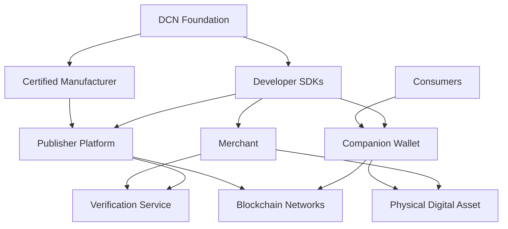
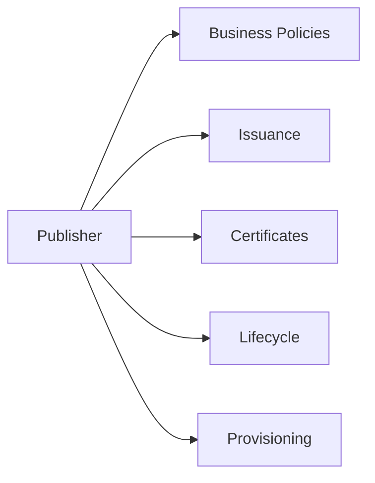
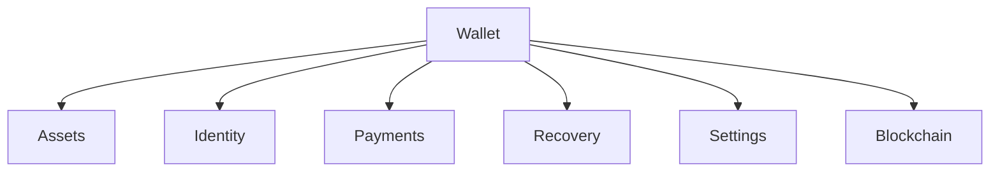
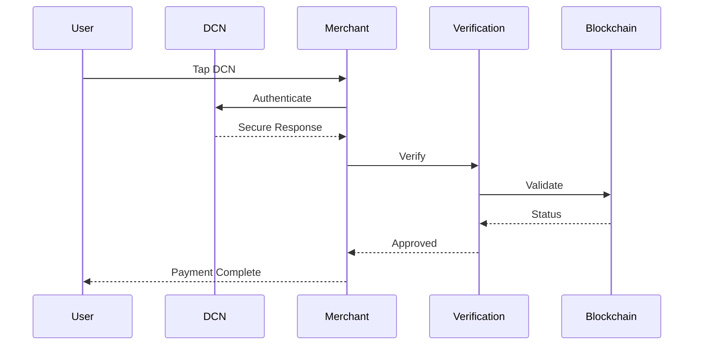
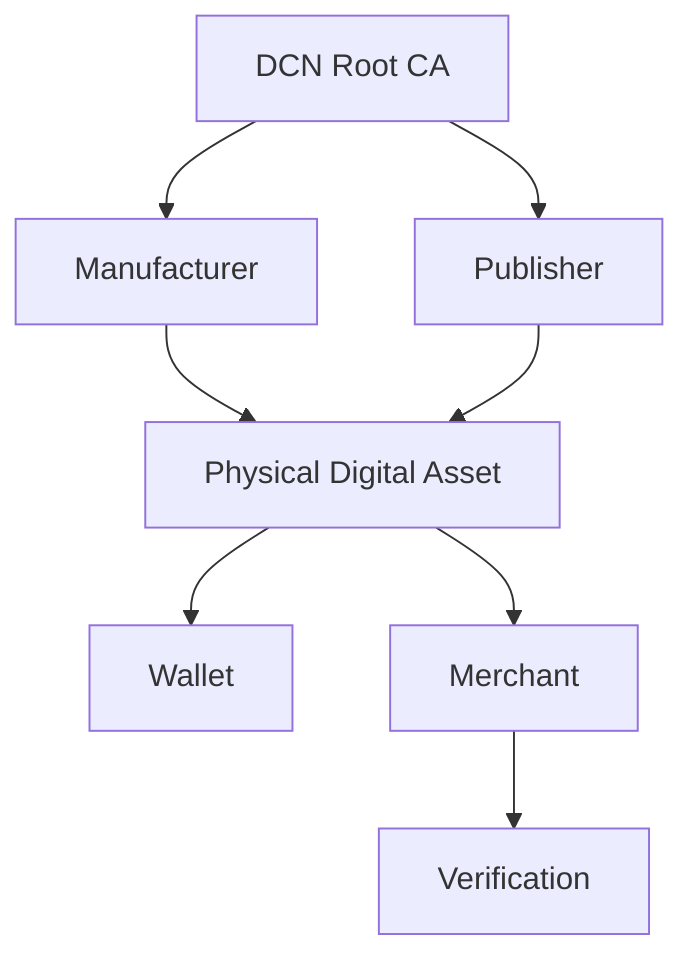
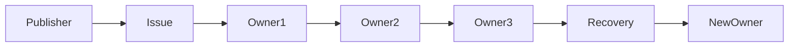
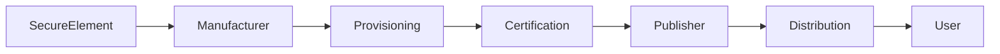
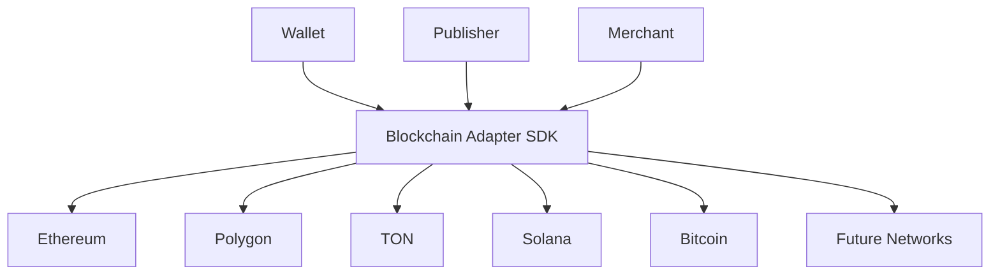
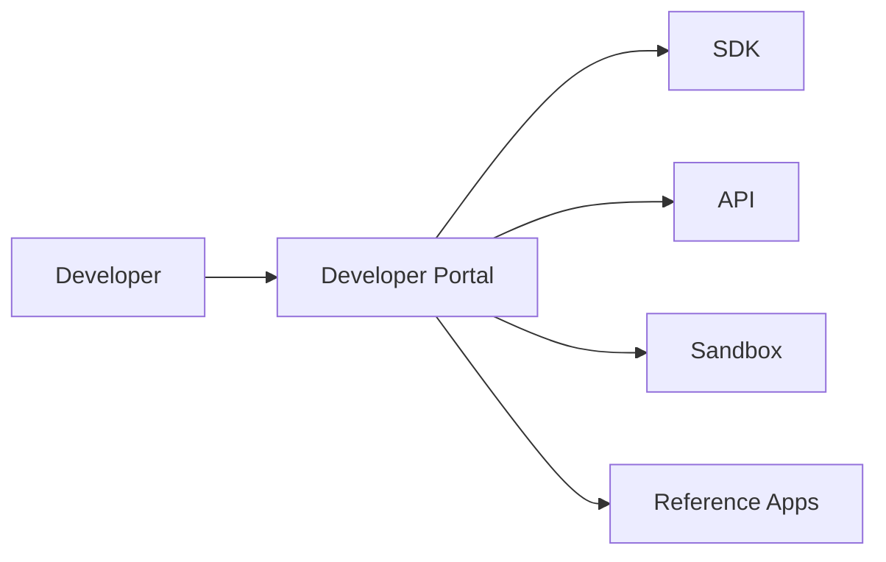
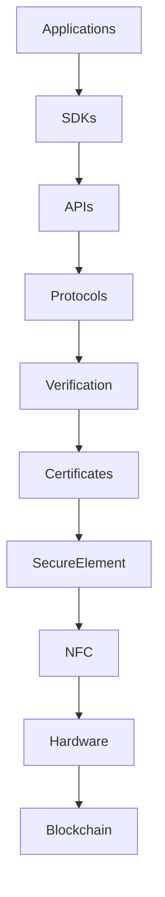

# Architecture Diagrams

> _This appendix provides high-level reference diagrams illustrating the architecture of the Digital Crypto Note (DCN) ecosystem. These diagrams are intended to help developers, solution architects, manufacturers, governments, and enterprises understand how the various components interact within a standards-compliant implementation._

***

## Introduction

Throughout this Vision Paper, individual diagrams have been presented to explain specific topics such as:

* Wallet Architecture
* Publisher Platform
* Payment Protocol
* Certificate Infrastructure
* Ownership
* Merchant Acceptance
* Manufacturing
* Security
* SDK Architecture

This appendix consolidates the complete ecosystem into a set of reference architecture diagrams.

These diagrams are **informative** and are intended to support implementation planning rather than prescribe a single deployment model.

***

## 1. Complete DCN Ecosystem

The DCN ecosystem consists of independent participants connected through open standards.

***

## 2. Publisher Architecture

Every Physical Digital Asset originates from a Publisher.

The Publisher controls issuance, lifecycle management, and business rules without controlling the underlying blockchain.

***

## 3. Wallet Architecture

The Companion Wallet serves as the user's management interface.

The wallet never stores sensitive Secure Element secrets. It acts as the user interface for interacting with Physical Digital Assets and blockchain services.

***

## 4. Payment Architecture

This sequence demonstrates the interaction between the physical asset, merchant, verification service, and blockchain.

***

## 5. Trust Architecture

The DCN ecosystem establishes trust through a hierarchical certificate model.

Every trust decision is based on cryptographic verification rather than visual inspection.

***

## 6. Ownership Architecture

Ownership may change throughout the asset lifecycle while maintaining a verifiable history according to Publisher policy.

***

## 7. Manufacturing Architecture

Every compliant device passes through secure manufacturing and provisioning before entering the ecosystem.

***

## 8. Blockchain Adapter Architecture

Applications communicate with one adapter interface while blockchain-specific logic remains isolated.

***

## 9. Developer Architecture

The developer platform provides the tools required to build interoperable DCN applications.

***

## 10. Complete Technology Stack

This layered architecture separates responsibilities while maintaining interoperability.

***

## Architectural Principles

The DCN architecture follows several guiding principles.

#### Modular

Each subsystem operates independently through standardized interfaces.

***

#### Layered

Applications, protocols, hardware, and blockchain infrastructure remain loosely coupled.

***

#### Interoperable

Independent implementations communicate using common standards.

***

#### Secure

Trust is established through cryptography, certificates, and Secure Elements.

***

#### Extensible

New blockchains, hardware platforms, and application categories can be added without redesigning the architecture.

***

## Summary

These architecture diagrams provide a consolidated technical view of the Digital Crypto Note ecosystem.

Together they illustrate how Publishers, Wallets, Physical Digital Assets, Merchants, Verification Services, Manufacturers, Developers, Blockchain Networks, and the DCN Foundation interact through open standards to create a secure, interoperable infrastructure for Physical Digital Assets.
