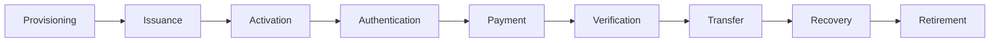
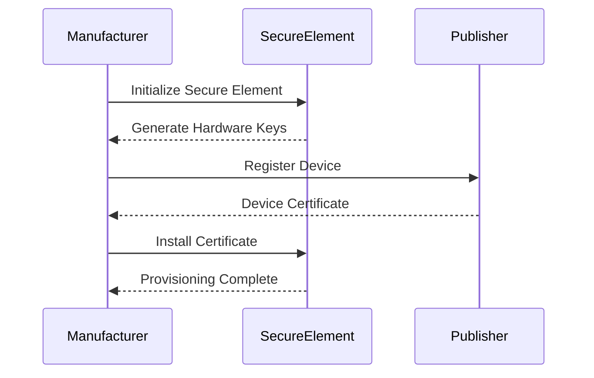
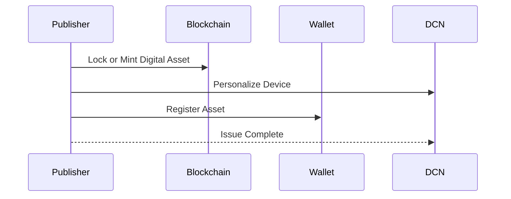
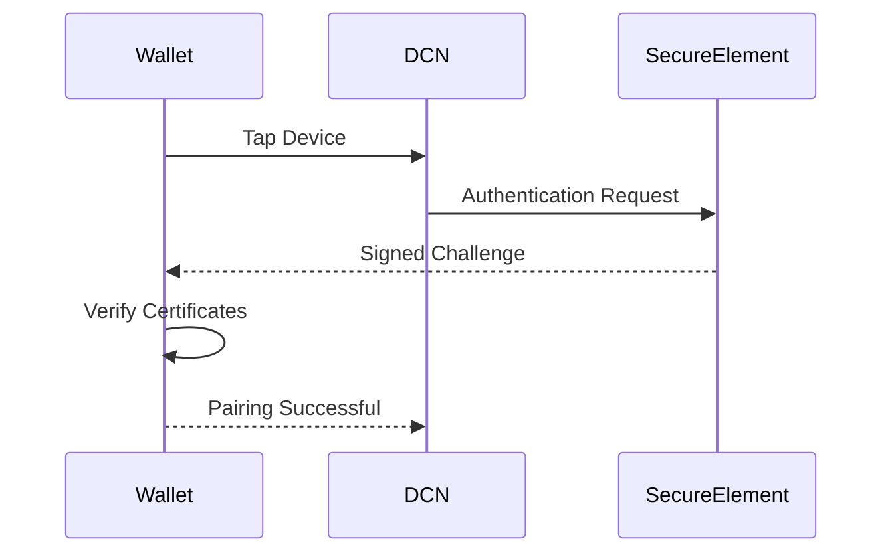
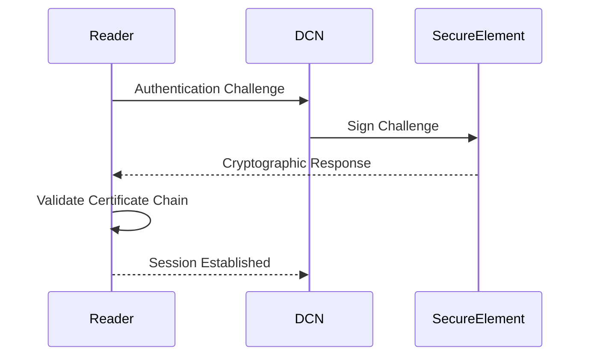
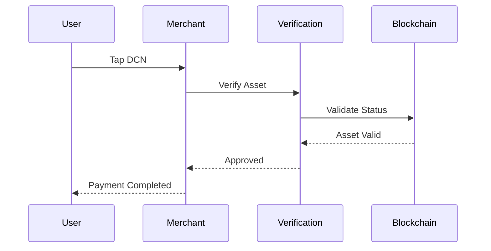
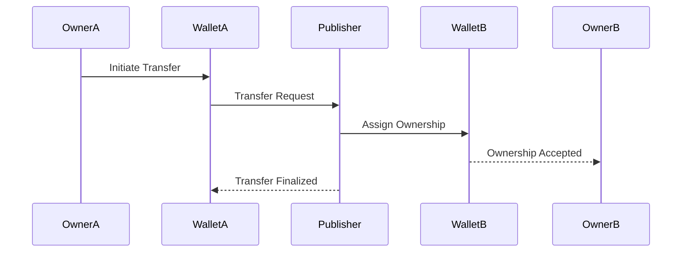
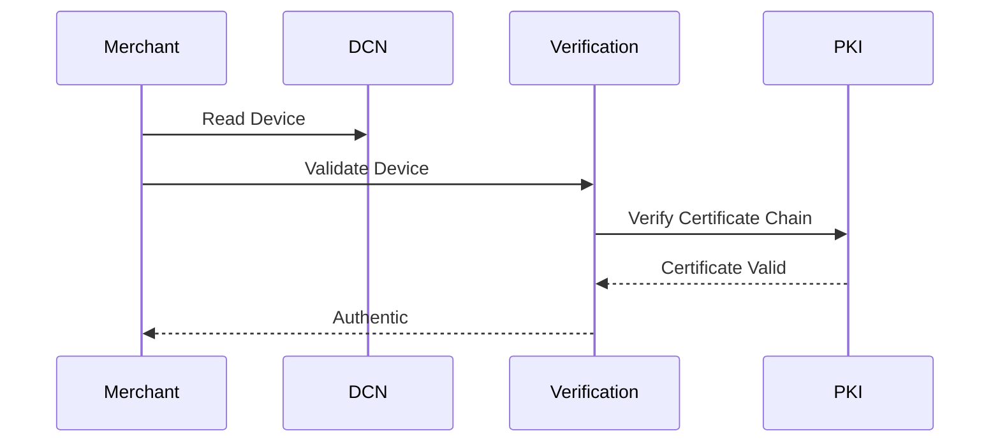
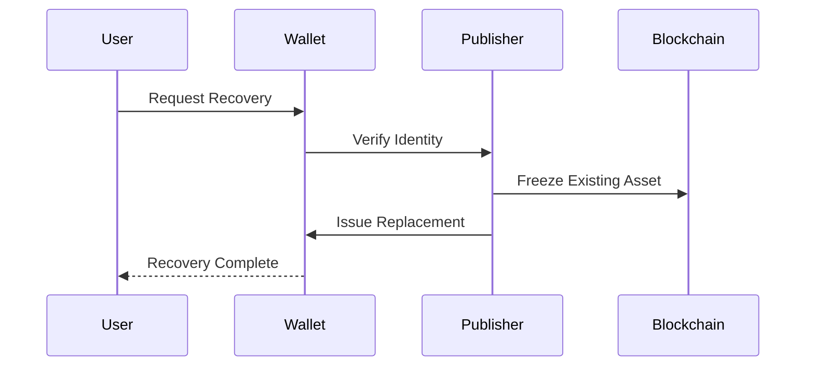
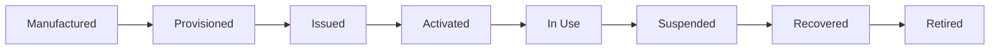

# Protocol Flow

> _This appendix illustrates the operational message flows used throughout the Digital Crypto Note (DCN) ecosystem. These protocol flows are informative reference models that demonstrate how Physical Digital Assets interact with Wallets, Publishers, Merchants, Verification Services, Secure Elements, and Blockchain Networks._

***

## Introduction

The DCN ecosystem consists of multiple protocols working together.

These protocols enable:

* Asset Issuance
* Device Provisioning
* Authentication
* Payments
* Ownership Transfer
* Verification
* Recovery
* Lifecycle Management

Although implementations may differ internally, compliant systems should preserve the same logical sequence of operations.

***

## Protocol Overview

Every Physical Digital Asset progresses through one or more of these protocol stages during its lifecycle.

***

## 1. Device Provisioning Protocol

Before a Physical Digital Asset leaves the factory, it must be securely provisioned.

Provisioning establishes the hardware identity and trust relationship before deployment.

***

## 2. Asset Issuance Protocol

A Publisher creates and assigns a new Physical Digital Asset.

Issuance binds the digital asset to the Physical Digital Asset according to Publisher policy.

***

## 3. Wallet Pairing Protocol

The Companion Wallet establishes a trusted relationship with the Physical Digital Asset.

Pairing enables future management operations while preserving device security.

***

## 4. Authentication Protocol

Every sensitive interaction begins with mutual authentication.

Only authenticated devices proceed to secure messaging.

***

## 5. Payment Protocol

The payment protocol enables secure merchant acceptance.

Payment approval depends on Publisher policy, asset status, and verification results.

***

## 6. Ownership Transfer Protocol

Ownership can be transferred between users when permitted by the Publisher.

Ownership changes are recorded according to the Publisher's asset model.

***

## 7. Verification Protocol

Verification confirms authenticity before trust is granted.

This protocol protects against counterfeit and unauthorized devices.

***

## 8. Recovery Protocol

If a Physical Digital Asset is lost or damaged, recovery follows Publisher policy.

Recovery procedures vary by Publisher and asset type.

***

## 9. Lifecycle Management Protocol

Lifecycle operations ensure assets remain manageable throughout their operational life.

***

## Protocol Design Principles

All DCN protocols follow common principles.

#### Secure by Default

Every critical operation begins with cryptographic authentication.

***

#### Stateless Communication

Each transaction contains sufficient information for verification without relying on long-lived sessions where practical.

***

#### Interoperable

Protocols are independent of hardware vendor, wallet provider, or blockchain implementation.

***

#### Modular

Each protocol can evolve independently while preserving compatibility.

***

#### Auditable

Protocol events can be logged and audited according to Publisher policy and regulatory requirements.

***

## Summary

The protocol flows described in this appendix illustrate how the Digital Crypto Note ecosystem operates from manufacturing through retirement.

Together, these reference flows demonstrate secure provisioning, issuance, authentication, payment, ownership transfer, verification, recovery, and lifecycle management using open standards, cryptographic trust, and interoperable architecture.
